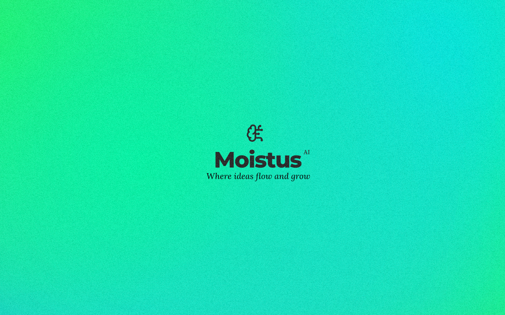

# Moistus AI - Intelligent Mind Mapping

Moistus AI is an open-source intelligent mind mapping platform designed to help you organize your thoughts, cultivate ideas, and discover new connections within your knowledge.

## Overview

In a world of information overload, Moistus AI stands as your digital thinking canvas. It empowers you to organize chaos into clarity, transform scattered thoughts into structured knowledge, and unlock insights you never knew existed within your own ideas.

## Purpose

Moistus AI was created with a clear mission: to boost productivity and spark creativity by providing a flexible system where knowledge can grow organically. Unlike rigid organizational tools, Moistus AI adapts to your unique thinking patterns, allowing you to:

- Capture and connect ideas in your own unique way
- Discover unexpected relationships between concepts
- Transform information overload into accessible knowledge structures
- Augment your thinking with AI assistance that enhances rather than replaces human creativity

## Key Features

- **Interactive Mind Mapping**: Create visually engaging mind maps with intuitive node connections
- **AI-Powered Insights**: Generate map structures, summarize content, and extract key concepts
- **Semantic Search**: Find relevant information across your knowledge base using natural language
- **Custom Node Types**: Use specialized nodes for different types of information (tasks, questions, resources, annotations)
- **Collaboration Tools**: Share and work together on mind maps (coming soon)
- **Responsive Design**: Access your mind maps from any device

## Technology Stack

Moistus AI is built using modern technologies:
- **Next.js & React**: For a fast, responsive frontend
- **TypeScript**: For type-safe code
- **Tailwind CSS**: For elegant, consistent styling
- **Supabase**: For authentication and database
- **Google Gemini AI**: For intelligent features

## Getting Started

1. Clone the repository
2. Install dependencies with `npm install`
3. Set up environment variables (see `.env.example`)
4. Run the development server with `npm run dev`
5. Visit `http://localhost:3000` to start mapping

## Contributing

Moistus AI is an open-source project and we welcome contributions from the community. Whether you're fixing bugs, improving documentation, or proposing new features, your help is appreciated.

1. Fork the repository
2. Create your feature branch (`git checkout -b feature/amazing-feature`)
3. Commit your changes (`git commit -m 'Add some amazing feature'`)
4. Push to the branch (`git push origin feature/amazing-feature`)
5. Open a Pull Request

## License

This project is licensed under the MIT License - see the LICENSE file for details.

## Vision

We believe that the best tools don't just organize what you already know—they help you discover what you don't. Moistus AI aims to be your thinking partner, helping you connect dots, spark new ideas, and make your knowledge more than the sum of its parts.

Join us in building a tool that makes thinking more productive, creative, and enjoyable.
