# Moistus AI - Comprehensive Codebase Analysis

## Executive Summary

Moistus AI is an intelligent mind mapping platform built with modern web technologies, designed to help users organize thoughts, cultivate ideas, and discover new connections within their knowledge. This analysis examines the codebase from three critical perspectives: software architecture, development practices, and product management.

**Key Highlights:**
- Modern Next.js 15 application with React 19
- AI-powered features using Google Gemini
- Supabase backend for authentication and data persistence
- Interactive mind mapping with ReactFlow
- Comprehensive state management using Zustand
- Strong TypeScript foundation with comprehensive type definitions

## 🏗️ Software Architecture Analysis

### System Architecture Overview

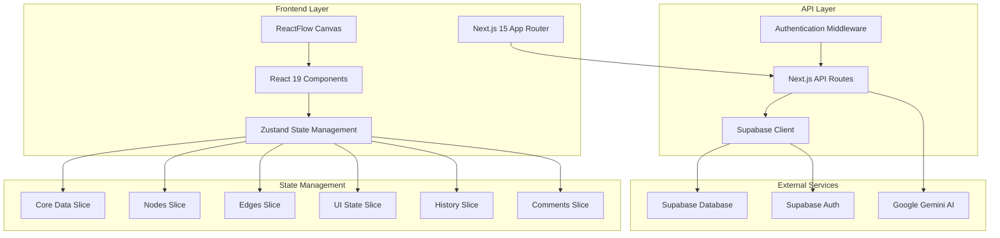

### Component Architecture

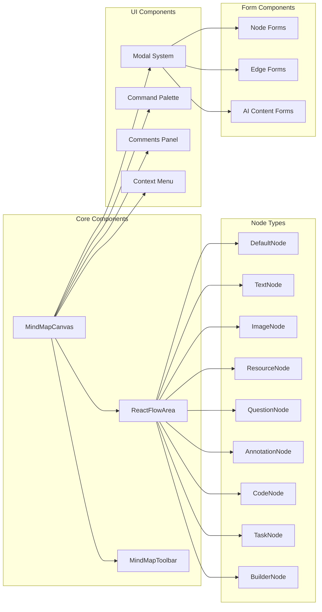

### Data Flow Architecture

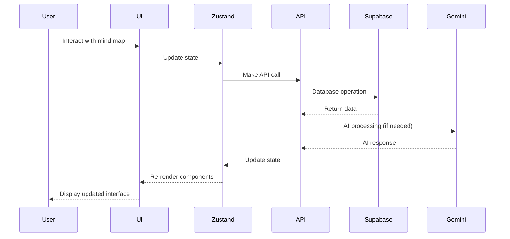

### Technology Stack Assessment

**Strengths:**
- **Modern React Ecosystem**: Next.js 15 with React 19 provides excellent performance and developer experience
- **Type Safety**: Comprehensive TypeScript implementation reduces runtime errors
- **Scalable State Management**: Zustand with slice pattern enables maintainable state architecture
- **Real-time Capabilities**: Supabase provides built-in real-time subscriptions
- **AI Integration**: Google Gemini integration for intelligent features

**Architecture Patterns:**
- **Component Composition**: Extensive use of HOCs and composite components
- **Slice Pattern**: State management divided into logical slices
- **API Route Handlers**: Centralized API logic with validation
- **Middleware Pattern**: Authentication and request processing

## 👨‍💻 Developer Perspective

### Code Quality Assessment

**Strengths:**
1. **Strong Type System**: Comprehensive TypeScript definitions across all layers
2. **Component Architecture**: Well-structured component hierarchy with clear separation of concerns
3. **State Management**: Clean slice-based architecture using Zustand
4. **API Design**: Consistent API routes with proper validation using Zod
5. **Modern Tooling**: ESLint, Prettier, and modern build tools

**Areas for Improvement:**
1. **Testing**: No visible test files - comprehensive testing strategy needed
2. **Documentation**: Limited inline documentation for complex business logic
3. **Error Handling**: Inconsistent error handling patterns across components
4. **Performance**: No visible performance optimizations like virtualization for large mind maps

### File Structure Analysis

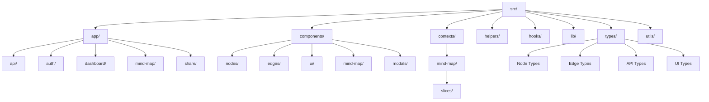

### Development Workflow

**Build System:**
- Next.js with Turbopack for fast development builds
- TypeScript compilation with strict type checking
- Tailwind CSS for utility-first styling
- Prettier for code formatting

**State Management Pattern:**
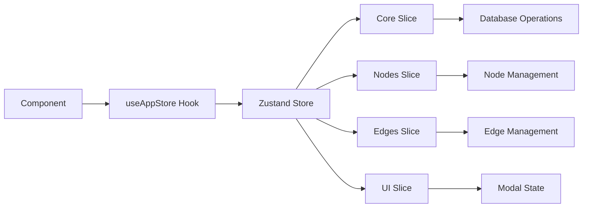

### API Architecture

The API follows RESTful patterns with specialized endpoints for AI operations:

**Core Endpoints:**
- `/api/maps` - Mind map CRUD operations
- `/api/generate-*` - AI content generation
- `/api/search-nodes` - Semantic search
- `/api/suggest-*` - AI-powered suggestions

**Authentication Flow:**
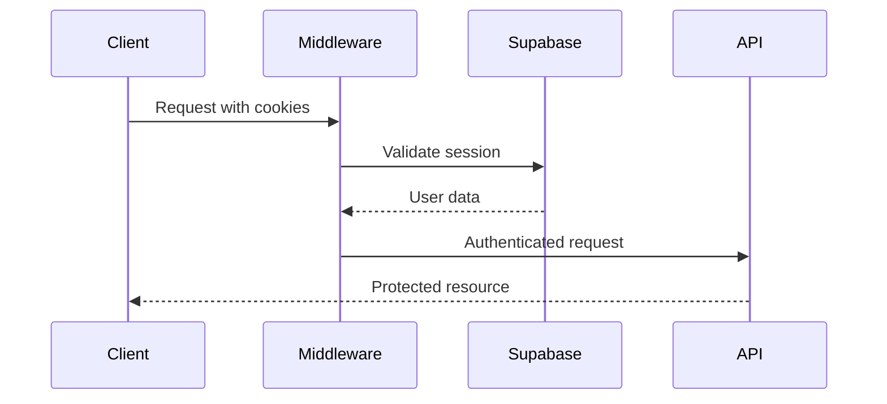

## 📊 Product Manager Perspective

### Feature Analysis

**Core Value Propositions:**
1. **Intelligent Mind Mapping**: AI-enhanced thought organization
2. **Collaborative Knowledge Building**: Real-time collaboration features
3. **Semantic Search**: Find information using natural language
4. **Multi-modal Content**: Support for text, images, code, tasks, and resources

### User Journey Mapping

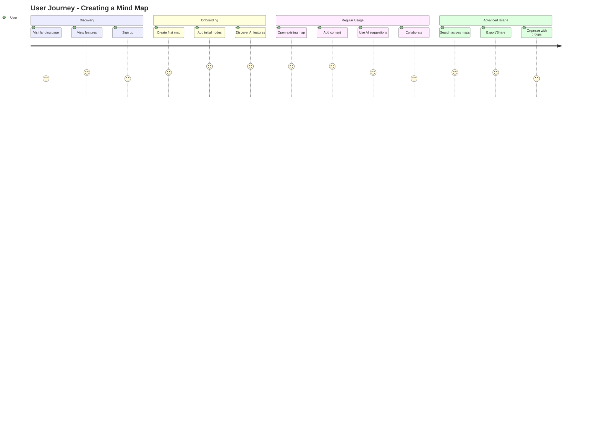

### Feature Categorization

**Core Features (MVP):**
- Basic mind mapping with nodes and edges
- User authentication and map persistence
- Basic AI content generation
- Responsive design

**Enhanced Features:**
- Multiple node types (text, image, code, task, question, annotation)
- AI-powered question answering
- Semantic search across content
- Comments and collaboration

**Advanced Features:**
- Real-time collaboration
- Map sharing with access controls
- AI-suggested connections and merges
- Branch summarization
- Export capabilities

### Competitive Analysis Framework

**Strengths vs Competitors:**
1. **AI Integration**: Deep AI integration throughout the experience
2. **Developer-Friendly**: Code nodes and technical content support
3. **Modern UX**: Clean, responsive interface with dark theme
4. **Open Source**: Community-driven development model

**Market Positioning:**
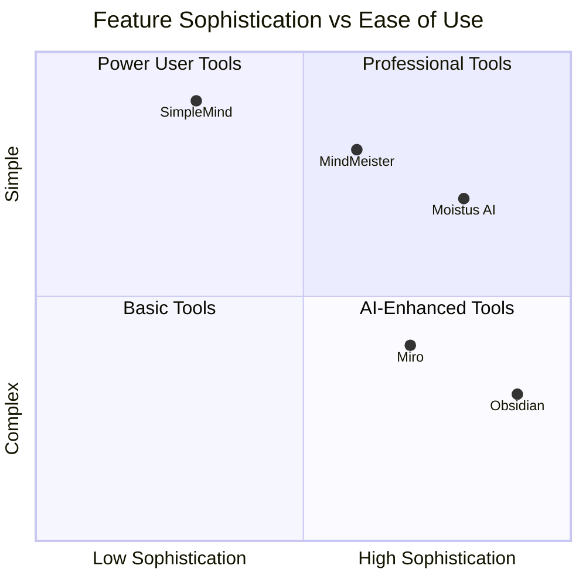

### Technical Debt Analysis

**High Priority:**
1. **Testing Infrastructure**: No visible test suite
2. **Performance Optimization**: Large mind maps may face performance issues
3. **Error Handling**: Inconsistent error boundaries and handling

**Medium Priority:**
1. **Documentation**: API documentation and component documentation
2. **Monitoring**: Application performance monitoring and error tracking
3. **Security**: Security audit and penetration testing

**Low Priority:**
1. **Code Organization**: Some components could be further modularized
2. **Accessibility**: ARIA labels and keyboard navigation improvements
3. **Internationalization**: Multi-language support preparation

## 🔧 Technical Implementation Details

### Node System Architecture

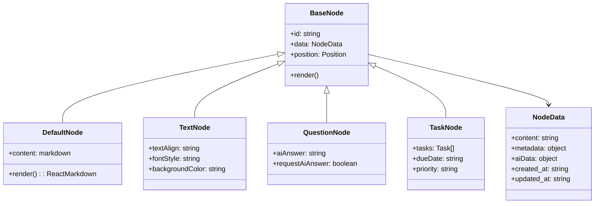

### AI Integration Pattern

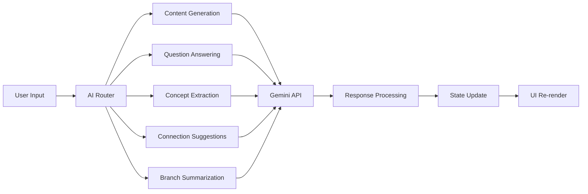

### Database Schema (Inferred)

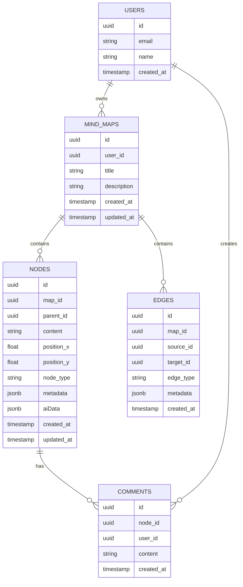

## 📈 Performance Considerations

### Current Performance Profile

**Strengths:**
- React 19 concurrent features for smooth user interactions
- Zustand for efficient state updates
- Next.js optimizations (image optimization, code splitting)
- Supabase real-time subscriptions for live updates

**Potential Bottlenecks:**
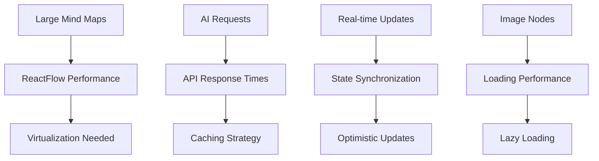

### Scalability Considerations

**Database Scaling:**
- Supabase handles horizontal scaling automatically
- Consider implementing database indexes for search operations
- Archive old mind maps for performance

**Frontend Scaling:**
- Implement virtual scrolling for large mind maps
- Code splitting for node type components
- Service worker for offline capabilities

## 🔐 Security Analysis

### Authentication & Authorization

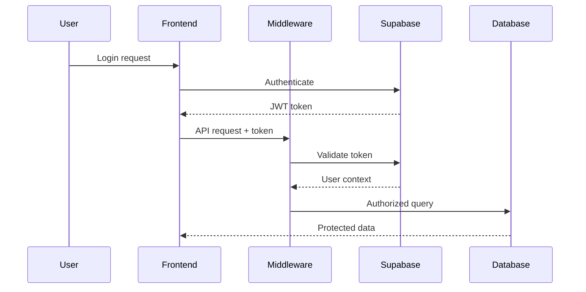

**Security Measures:**
- JWT-based authentication via Supabase
- Server-side session validation
- Row Level Security (RLS) in Supabase
- Environment variable protection for API keys

**Areas for Enhancement:**
- Input sanitization for AI content
- Rate limiting for AI API calls
- Content Security Policy (CSP) headers
- CSRF protection

## 💡 Recommendations

### Immediate Actions (0-1 months)

1. **Testing Infrastructure**
   - Implement Jest + React Testing Library
   - Add API endpoint tests
   - Create component integration tests

2. **Performance Optimization**
   - Implement React.memo for expensive node components
   - Add virtualization for large mind maps
   - Optimize bundle size with dynamic imports

3. **Error Handling**
   - Implement comprehensive error boundaries
   - Add consistent API error handling
   - Create user-friendly error messages

### Short-term Goals (1-3 months)

1. **Developer Experience**
   - Add Storybook for component documentation
   - Implement hot reload for faster development
   - Create development setup automation

2. **User Experience**
   - Add keyboard shortcuts documentation
   - Implement undo/redo visual indicators
   - Create onboarding tutorial

3. **Monitoring & Analytics**
   - Implement application performance monitoring
   - Add user behavior analytics
   - Create error tracking dashboard

### Long-term Vision (3-6 months)

1. **Platform Evolution**
   - Mobile application development
   - Offline-first architecture
   - Advanced collaboration features

2. **AI Enhancement**
   - Custom AI model training
   - Advanced semantic search
   - Predictive content suggestions

3. **Enterprise Features**
   - Team management
   - Advanced sharing controls
   - Enterprise SSO integration

## 📋 Conclusion

Moistus AI represents a well-architected, modern mind mapping application with strong foundations in React, TypeScript, and AI integration. The codebase demonstrates good software engineering practices with room for improvement in testing, performance optimization, and documentation.

**Key Strengths:**
- Modern technology stack with future-proof architecture
- Comprehensive type system reducing runtime errors
- Intelligent AI integration enhancing user productivity
- Clean component architecture enabling rapid feature development

**Strategic Priorities:**
1. Establish robust testing and quality assurance processes
2. Optimize performance for large-scale mind maps
3. Enhance developer experience and documentation
4. Build comprehensive monitoring and analytics capabilities

The application is well-positioned to compete in the knowledge management and mind mapping space, with its AI-first approach providing significant differentiation in the market.