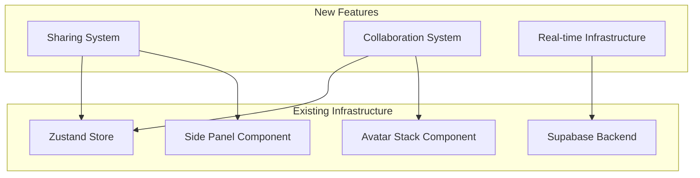

# Moistus AI Collaboration & Sharing Features - Implementation Plan

**Document Version:** 1.0  
**Date:** December 2024  
**Status:** Ready for Implementation  
**Estimated Timeline:** 12 weeks  

## Executive Summary

This implementation plan covers the development of comprehensive collaboration and sharing features for Moistus AI, based on two core PRDs:

1. **Collaboration Features** - Real-time presence, cursors, activity tracking
2. **Mind Map Sharing** - Room codes, permissions, guest access

The features will be implemented in a carefully orchestrated sequence, with sharing foundations laid first to support the collaboration layer.

## 🏗️ Technical Architecture Overview

### System Integration Points



### Key Architectural Decisions

**1. Sharing Foundation First**
- Implement sharing system before collaboration features
- Sharing provides permission context for collaboration
- Guest users need access before real-time features

**2. Extend Existing Patterns**
- Leverage existing Zustand slice architecture
- Reuse side panel component for sharing interface
- Build upon existing avatar stack component

**3. Database Schema Extensions**
- Database tables already exist (collaboration setup complete)
- Add sharing-specific tables for room codes and tokens
- Extend existing tables for guest user support

## 📋 Implementation Phases

### Phase 1: Sharing Foundation (Weeks 1-3)

**Goal:** Establish core sharing infrastructure and basic functionality

#### Week 1: Database & Types Setup

**Tasks:**
- [ ] **SP-001:** Create sharing-specific database tables
  - Add `share_tokens` table for room codes and links
  - Add `guest_users` table for temporary user sessions
  - Add permission validation triggers
  - **Files:** `database/sharing-setup.sql`
  - **Success:** Tables created with proper RLS policies

- [ ] **SP-002:** Define TypeScript types for sharing system
  - Create `types/sharing-types.ts` with comprehensive interfaces
  - Define permission enums and validation schemas
  - Add Zod schemas for API validation
  - **Files:** `src/types/sharing-types.ts`
  - **Success:** All sharing types properly typed and validated

- [ ] **SP-003:** Create Zustand sharing slice
  - Implement sharing state management
  - Add actions for creating/managing shares
  - Integrate with existing UI slice patterns
  - **Files:** `src/contexts/mind-map/slices/sharing-slice.ts`
  - **Success:** Sharing state properly managed in Zustand store

#### Week 2: Core Sharing API

**Tasks:**
- [ ] **SP-004:** Implement sharing API endpoints
  - `/api/share/create` - Create new share with token
  - `/api/share/[token]` - Get share details by token
  - `/api/share/access` - Validate and grant access
  - `/api/share/revoke` - Revoke share access
  - **Files:** `src/app/api/share/*`
  - **Success:** All sharing endpoints functional with proper validation

- [ ] **SP-005:** Add room code generation system
  - Generate unique 6-digit alphanumeric codes
  - Implement collision detection and retry logic
  - Add code expiration and cleanup
  - **Files:** `src/lib/room-codes.ts`
  - **Success:** Room codes generate reliably and uniquely

- [ ] **SP-006:** Create guest user authentication
  - Temporary session creation for non-registered users
  - Guest user profile management
  - Session cleanup and conversion tracking
  - **Files:** `src/lib/guest-auth.ts`
  - **Success:** Guest users can access shared maps seamlessly

#### Week 3: Sharing UI Components

**Tasks:**
- [ ] **SP-007:** Build sharing panel interface
  - Extend side panel for sharing controls
  - Room code display and management
  - Permission level selector
  - Active users list with management
  - **Files:** `src/components/sharing/share-panel.tsx`
  - **Success:** Complete sharing interface accessible via side panel

- [ ] **SP-008:** Create room joining experience
  - Dedicated join page with room code entry
  - Share link direct access
  - User-friendly error handling
  - **Files:** `src/app/join/*`, `src/components/sharing/join-room.tsx`
  - **Success:** Users can join rooms via code or link under 10 seconds

- [ ] **SP-009:** Implement permission management UI
  - Role-based access control interface
  - Permission matrix display
  - Bulk permission updates
  - **Files:** `src/components/sharing/permission-manager.tsx`
  - **Success:** Granular permission control with clear visual feedback

### Phase 2: Real-time Infrastructure (Weeks 4-6)

**Goal:** Establish robust real-time communication and presence system

#### Week 4: Supabase Real-time Setup

**Tasks:**
- [ ] **RT-001:** Enhance collaboration slice with real-time features
  - Extend existing collaboration slice
  - Implement proper Supabase channel management
  - Add connection recovery and error handling
  - **Files:** `src/contexts/mind-map/slices/collaboration-slice.ts`
  - **Success:** Reliable real-time connection with graceful degradation

- [ ] **RT-002:** Implement presence tracking system
  - Real-time user join/leave events
  - Heartbeat mechanism for connection health
  - Presence status management (active/idle/away)
  - **Files:** `src/lib/presence-manager.ts`
  - **Success:** Accurate presence tracking with < 2 second updates

- [ ] **RT-003:** Create activity logging infrastructure
  - Comprehensive activity tracking
  - Batch operations for performance
  - Real-time activity feed updates
  - **Files:** `src/lib/activity-logger.ts`
  - **Success:** All user actions logged with real-time updates

#### Week 5: Cursor & Selection System

**Tasks:**
- [ ] **RT-004:** Implement multi-user cursor tracking
  - Real-time cursor position updates
  - Smooth cursor rendering with user identification
  - Performance optimization with throttling
  - **Files:** `src/components/collaboration/cursor-overlay.tsx`
  - **Success:** Smooth cursor tracking at 60fps with minimal performance impact

- [ ] **RT-005:** Build collaborative node selection
  - Real-time selection indicators
  - Editing conflict prevention
  - Selection queue management
  - **Files:** `src/components/collaboration/selection-manager.tsx`
  - **Success:** Clear selection feedback preventing editing conflicts

- [ ] **RT-006:** Create conflict resolution system
  - Optimistic updates with rollback
  - Conflict detection and resolution UI
  - User notification system
  - **Files:** `src/components/collaboration/conflict-resolver.tsx`
  - **Success:** Conflicts resolved gracefully with user guidance

#### Week 6: Enhanced Avatar & Presence UI

**Tasks:**
- [ ] **RT-007:** Enhance avatar stack component
  - Real-time user addition/removal
  - Click-to-follow user functionality
  - Enhanced tooltips with presence info
  - **Files:** `src/components/collaboration/avatar-stack/*`
  - **Success:** Interactive avatar stack showing real-time presence

- [ ] **RT-008:** Build activity feed component
  - Real-time activity stream
  - Filtering and search functionality
  - Infinite scroll with virtualization
  - **Files:** `src/components/collaboration/activity-feed.tsx`
  - **Success:** Performant activity feed supporting 1000+ entries

- [ ] **RT-009:** Create presence indicators
  - Node-level presence indicators
  - Typing indicators for editors
  - Visual feedback for all collaboration states
  - **Files:** `src/components/collaboration/presence-indicators.tsx`
  - **Success:** Clear visual feedback for all collaboration activities

### Phase 3: Advanced Collaboration Features (Weeks 7-9)

**Goal:** Complete collaboration feature set with advanced functionality

#### Week 7: Activity Tracking & Analytics

**Tasks:**
- [ ] **AC-001:** Build comprehensive activity system
  - Advanced activity filtering
  - Change summaries and diff visualization
  - Activity search and navigation
  - **Files:** `src/components/collaboration/activity-system/*`
  - **Success:** Complete activity tracking with advanced features

- [ ] **AC-002:** Implement collaboration analytics
  - Session tracking and insights
  - User participation metrics
  - Collaboration health indicators
  - **Files:** `src/lib/collaboration-analytics.ts`
  - **Success:** Detailed collaboration insights for map owners

- [ ] **AC-003:** Create change visualization
  - Visual indicators for recent changes
  - Timeline scrubber for historical view
  - Change highlighting with fade-out
  - **Files:** `src/components/collaboration/change-visualizer.tsx`
  - **Success:** Clear visual feedback for all changes with timeline navigation

#### Week 8: Performance Optimization

**Tasks:**
- [ ] **AC-004:** Optimize real-time performance
  - Connection pooling and management
  - Event batching and throttling
  - Memory management for long sessions
  - **Files:** Performance optimizations across collaboration layer
  - **Success:** System handles 50+ concurrent users per map

- [ ] **AC-005:** Implement offline support
  - Offline queue for pending operations
  - Reconnection logic with sync
  - Graceful degradation without real-time
  - **Files:** `src/lib/offline-manager.ts`
  - **Success:** Seamless offline experience with sync on reconnection

- [ ] **AC-006:** Add virtualization for large datasets
  - Activity feed virtualization
  - Large user list optimization
  - Cursor rendering optimization
  - **Files:** Virtual scroll implementations
  - **Success:** Smooth performance with 1000+ activities and 100+ users

#### Week 9: Integration Testing & Polish

**Tasks:**
- [ ] **AC-007:** Comprehensive integration testing
  - Cross-browser collaboration testing
  - Network failure recovery testing
  - Concurrent user stress testing
  - **Files:** Test scenarios and validation
  - **Success:** Robust collaboration under all conditions

- [ ] **AC-008:** UI/UX refinements
  - Animation and transition polish
  - Accessibility improvements
  - Mobile responsiveness optimization
  - **Files:** UI component refinements
  - **Success:** Professional, accessible collaboration experience

- [ ] **AC-009:** Error handling and edge cases
  - Comprehensive error boundaries
  - User-friendly error messages
  - Recovery mechanisms for all failure modes
  - **Files:** Error handling across collaboration system
  - **Success:** Graceful handling of all error scenarios

### Phase 4: Advanced Sharing & Polish (Weeks 10-12)

**Goal:** Complete advanced sharing features and production polish

#### Week 10: Advanced Sharing Features

**Tasks:**
- [ ] **AS-001:** Implement advanced permission features
  - Time-limited access controls
  - Permission inheritance and overrides
  - Bulk permission management
  - **Files:** Advanced permission management components
  - **Success:** Granular permission control meeting enterprise needs

- [ ] **AS-002:** Build sharing analytics
  - Share engagement tracking
  - Access pattern analytics
  - Conversion metrics for guest users
  - **Files:** `src/lib/sharing-analytics.ts`
  - **Success:** Comprehensive sharing insights and metrics

- [ ] **AS-003:** Create public sharing features
  - Public link generation
  - Embed code generation
  - SEO optimization for shared maps
  - **Files:** Public sharing components and pages
  - **Success:** Public sharing supporting viral growth

#### Week 11: Mobile & Accessibility

**Tasks:**
- [ ] **AS-004:** Mobile collaboration optimization
  - Touch-optimized collaboration controls
  - Mobile cursor and selection handling
  - Responsive collaboration UI
  - **Files:** Mobile-specific collaboration components
  - **Success:** Full collaboration support on mobile devices

- [ ] **AS-005:** Accessibility compliance
  - ARIA labels for collaboration features
  - Keyboard navigation for all features
  - Screen reader support
  - **Files:** Accessibility enhancements across features
  - **Success:** WCAG 2.1 AA compliance for all collaboration features

- [ ] **AS-006:** Cross-platform testing
  - iOS/Android browser testing
  - Desktop browser compatibility
  - Performance validation across platforms
  - **Files:** Cross-platform validation
  - **Success:** Consistent experience across all supported platforms

#### Week 12: Production Readiness

**Tasks:**
- [ ] **AS-007:** Security audit and hardening
  - Permission validation audit
  - SQL injection prevention validation
  - Rate limiting implementation
  - **Files:** Security enhancements and validation
  - **Success:** Production-ready security posture

- [ ] **AS-008:** Performance monitoring setup
  - Real-time performance metrics
  - Error tracking and alerting
  - User experience monitoring
  - **Files:** Monitoring and analytics setup
  - **Success:** Comprehensive production monitoring

- [ ] **AS-009:** Documentation and deployment
  - API documentation completion
  - User guide creation
  - Deployment preparation and testing
  - **Files:** Documentation and deployment assets
  - **Success:** Complete documentation and smooth deployment process

## 🔧 Technical Implementation Details

### Database Schema Extensions

**New Tables Required:**

```sql
-- Share tokens for room codes and direct links
CREATE TABLE share_tokens (
    id UUID PRIMARY KEY DEFAULT gen_random_uuid(),
    map_id UUID REFERENCES mind_maps(id) ON DELETE CASCADE,
    token VARCHAR(6) UNIQUE NOT NULL, -- Room code
    token_type VARCHAR(20) DEFAULT 'room_code', -- 'room_code', 'direct_link'
    share_link_hash VARCHAR(64) UNIQUE, -- For direct links
    permissions JSONB NOT NULL, -- Permission configuration
    max_users INTEGER DEFAULT 50,
    expires_at TIMESTAMP WITH TIME ZONE,
    is_active BOOLEAN DEFAULT TRUE,
    created_by UUID REFERENCES auth.users(id),
    created_at TIMESTAMP WITH TIME ZONE DEFAULT NOW()
);

-- Guest user sessions
CREATE TABLE guest_users (
    id UUID PRIMARY KEY DEFAULT gen_random_uuid(),
    session_id VARCHAR(255) UNIQUE NOT NULL,
    display_name VARCHAR(255),
    email VARCHAR(255),
    avatar_url TEXT,
    fingerprint_hash VARCHAR(64), -- Browser fingerprint
    first_seen TIMESTAMP WITH TIME ZONE DEFAULT NOW(),
    last_activity TIMESTAMP WITH TIME ZONE DEFAULT NOW(),
    conversion_date TIMESTAMP WITH TIME ZONE, -- When converted to registered user
    converted_user_id UUID REFERENCES auth.users(id)
);
```

### API Endpoint Specifications

**Sharing Endpoints:**

- `POST /api/share/create` - Create new share token
- `GET /api/share/[token]` - Get share details and validate access
- `POST /api/share/access` - Join shared map (guest or authenticated)
- `DELETE /api/share/revoke` - Revoke share access
- `PUT /api/share/permissions` - Update share permissions

**Collaboration Endpoints:**

- `POST /api/collaboration/join` - Join collaboration session
- `DELETE /api/collaboration/leave` - Leave collaboration session
- `POST /api/collaboration/activity` - Log collaboration activity
- `GET /api/collaboration/activities` - Get activity feed

### State Management Architecture

**Extended Zustand Slices:**

```typescript
// Enhanced UI slice for sharing panels
interface UISlice {
  popoverOpen: {
    // ... existing popovers
    sharePanel: boolean;
    activityFeed: boolean;
    permissionManager: boolean;
  };
}

// New sharing slice
interface SharingSlice {
  currentShares: ShareToken[];
  activeShare?: ShareToken;
  guestUsers: GuestUser[];
  sharePermissions: PermissionMatrix;
  isCreatingShare: boolean;
  shareError?: string;
  
  // Actions
  createShare: (config: ShareConfig) => Promise<ShareToken>;
  revokeShare: (tokenId: string) => Promise<void>;
  updatePermissions: (tokenId: string, permissions: Permissions) => Promise<void>;
  joinByToken: (token: string) => Promise<void>;
}
```

### Component Architecture

**New Component Structure:**

```
src/components/
├── sharing/
│   ├── share-panel.tsx           # Main sharing interface
│   ├── room-code-display.tsx     # Room code with QR code
│   ├── permission-manager.tsx    # Permission control interface
│   ├── guest-user-list.tsx       # Guest user management
│   └── share-analytics.tsx       # Sharing metrics display
├── collaboration/
│   ├── cursor-overlay.tsx        # Multi-user cursor rendering
│   ├── activity-feed.tsx         # Real-time activity stream
│   ├── presence-indicators.tsx   # Node-level presence indicators
│   ├── conflict-resolver.tsx     # Conflict resolution UI
│   └── collaboration-toolbar.tsx # Collaboration controls
└── join/
    ├── join-room.tsx             # Room joining interface
    ├── guest-signup.tsx          # Guest user creation
    └── access-denied.tsx         # Permission error handling
```

## 📊 Success Metrics & Validation

### Key Performance Indicators

**Technical Performance:**
- [ ] Real-time event delivery < 100ms latency
- [ ] System supports 50+ concurrent users per map
- [ ] Activity feed loads < 2 seconds for 1000+ entries
- [ ] Join process completes < 10 seconds end-to-end
- [ ] 99.9% uptime for collaboration features

**User Experience:**
- [ ] Guest user conversion rate > 15%
- [ ] Collaboration session duration increase > 40%
- [ ] Feature adoption rate > 60% for shared maps
- [ ] User satisfaction score > 4.5/5 for collaboration
- [ ] Mobile collaboration usage > 30%

**Feature Completeness:**
- [ ] All PRD requirements implemented and tested
- [ ] WCAG 2.1 AA accessibility compliance
- [ ] Cross-platform compatibility verified
- [ ] Security audit passed with no critical issues
- [ ] Performance benchmarks met under load

### Testing Strategy

**Unit Testing:**
- Zustand slice logic and state management
- API endpoint validation and error handling
- Utility functions and helper methods

**Integration Testing:**
- Real-time collaboration scenarios
- Permission system end-to-end flows
- Guest user journey and conversion
- Cross-browser collaboration compatibility

**Performance Testing:**
- Concurrent user load testing
- Real-time event throughput testing
- Activity feed performance with large datasets
- Mobile device performance validation

**Security Testing:**
- Permission bypass attempt testing
- Input sanitization and validation
- Rate limiting effectiveness
- Authentication and authorization flows

## 🚨 Risk Mitigation

### High-Risk Areas

**1. Real-time Performance at Scale**
- **Mitigation:** Implement connection pooling, event batching, performance monitoring
- **Fallback:** Graceful degradation to polling-based updates

**2. Data Consistency in Collaboration**
- **Mitigation:** Optimistic updates with rollback, conflict detection, comprehensive testing
- **Fallback:** Last-write-wins with user notification

**3. Guest User Security**
- **Mitigation:** Session-based isolation, permission validation, rate limiting
- **Fallback:** Disable guest access, require authentication

**4. Cross-platform Compatibility**
- **Mitigation:** Progressive enhancement, polyfills, comprehensive testing
- **Fallback:** Feature detection with graceful degradation

### Monitoring & Alerting

**Real-time Monitoring:**
- Collaboration connection success rates
- Real-time event delivery latency
- Guest user conversion funnel
- Error rates and failure patterns

**Performance Alerts:**
- Response time degradation > 500ms
- Concurrent user limits exceeded
- Database connection pool exhaustion
- Client-side error rate > 1%

## 📚 Dependencies & Prerequisites

### Required Package Updates

```json
{
  "dependencies": {
    "@supabase/realtime-js": "^2.10.0",
    "react-qr-code": "^2.0.12",
    "react-use-gesture": "^9.1.3",
    "canvas": "^2.11.2"
  },
  "devDependencies": {
    "@testing-library/react": "^16.0.0",
    "@testing-library/jest-dom": "^6.4.0",
    "jest": "^29.7.0"
  }
}
```

### Environment Variables

```env
# Real-time configuration
NEXT_PUBLIC_SUPABASE_REALTIME_URL=wss://...
COLLABORATION_MAX_USERS=50
GUEST_SESSION_DURATION=86400

# Sharing configuration  
SHARE_TOKEN_EXPIRY_HOURS=24
ROOM_CODE_LENGTH=6
MAX_SHARES_PER_MAP=10

# Performance settings
CURSOR_UPDATE_THROTTLE=16
ACTIVITY_BATCH_SIZE=10
PRESENCE_HEARTBEAT_INTERVAL=30000
```

### Database Migrations

- [ ] Run collaboration setup script (already exists)
- [ ] Execute sharing tables migration
- [ ] Set up scheduled cleanup functions
- [ ] Configure real-time triggers

## ✅ Implementation Checklist

This plan provides a comprehensive roadmap for implementing both collaboration and sharing features. Each phase builds upon the previous one, ensuring a stable foundation while progressively adding functionality.

The implementation should be approached incrementally, with thorough testing at each milestone to ensure quality and performance standards are maintained throughout the development process.

**Next Step:** Begin Phase 1, Week 1 with database setup and TypeScript type definitions.