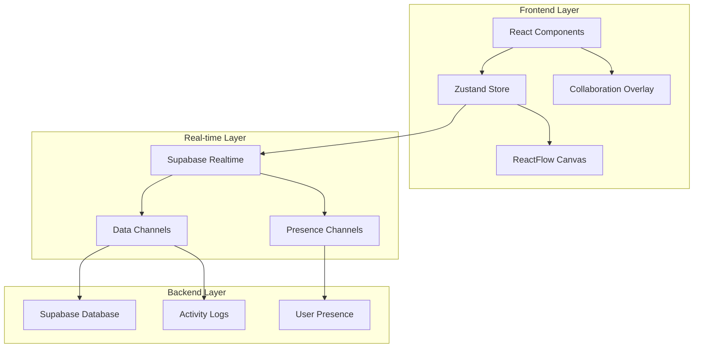

# Moistus AI Collaboration Features - Product Requirements Document

**Document Version:** 1.0
**Date:** December 2024
**Author:** Product Team
**Status:** Draft for Review

---

## Executive Summary

Moistus AI currently operates as a single-user mind mapping platform with AI-enhanced capabilities. To unlock the platform's full potential and compete effectively in the knowledge management space, we need to introduce comprehensive real-time collaboration features that enable teams to co-create, edit, and evolve mind maps together.

This PRD outlines the development of core collaboration features including real-time presence indicators, multi-user cursors, collaborative node editing, change tracking, and activity summaries. These features will transform Moistus AI from an individual productivity tool into a powerful team collaboration platform.

**Key Business Objectives:**

- Increase user engagement and retention through collaborative workflows
- Enable enterprise sales through team-focused features
- Differentiate from competitors with AI-enhanced collaboration
- Create network effects that drive viral growth

---

## User Personas & Scenarios

### Primary Personas

**1. Team Lead - Sarah (Project Manager)**

- Needs to coordinate multiple team members on complex projects
- Wants to see who's actively working on which parts of the mind map
- Requires visibility into changes and contributions from team members
- Values real-time coordination to avoid conflicts and duplication

**2. Remote Developer - Marcus (Software Engineer)**

- Works across different time zones with distributed team
- Needs to understand context of changes made while offline
- Wants to see what teammates are currently focusing on
- Values efficient async collaboration with clear change tracking

**3. Design Consultant - Elena (UX Designer)**

- Collaborates with multiple client teams simultaneously
- Needs to provide real-time feedback during ideation sessions
- Wants to guide team attention to specific nodes during discussions
- Values visual indicators of team engagement and focus areas

### User Scenarios

**Scenario 1: Real-time Brainstorming Session**
Sarah leads a team brainstorming session with 5 team members. She can see everyone's avatars at the top of the screen, watch their cursors move around the mind map, and observe which nodes each person is selecting or editing. When Marcus selects a cluster of nodes, his avatar appears next to them, and Sarah can guide the team's attention by highlighting specific areas.

**Scenario 2: Async Collaboration Review**
Elena opens a mind map that her team worked on overnight. She immediately sees a comprehensive activity summary showing which nodes were added, modified, or discussed. She can filter changes by team member, time period, or node type, allowing her to quickly understand the evolution of ideas and provide targeted feedback.

**Scenario 3: Distributed Team Coordination**
Marcus joins a mind map where his teammates are already working. He sees their real-time cursors and can observe their current focus areas. When he selects a node to edit, other team members see his avatar appear, preventing editing conflicts and encouraging natural coordination.

---

## Feature Requirements

### 1. Real-time Presence System

**1.1 Active Users Avatar Stack**

- **Requirement:** Display a horizontal stack of user avatars showing all currently active users on the mind map
- **Location:** Top-right corner of the mind map canvas
- **Behavior:**
  - Show up to 8 avatars with "+N more" indicator for larger groups
  - Avatars update in real-time as users join/leave
  - Hover shows user name, role, and last activity timestamp
  - Click on avatar centers view on that user's current cursor position
- **Visual Design:** Circular avatars with subtle border indicating active status (green ring)

**1.2 User Presence States**

- **Active:** User is currently viewing and interacting with the mind map
- **Idle:** User has the mind map open but no activity for 5+ minutes
- **Away:** User navigated away or closed the tab
- **Offline:** User disconnected or explicitly logged out

### 2. Multi-User Cursor System

**2.1 Real-time Cursor Tracking**

- **Requirement:** Display live cursor positions for all active users on the canvas
- **Visual Design:**
  - Custom cursor with user's avatar/initials
  - Smooth animation following mouse movement
  - Distinctive color per user (generated from user ID)
  - Fade out after 10 seconds of inactivity
- **Performance:**
  - Throttled updates (max 60fps)
  - Efficient rendering using canvas overlay
  - Automatic cleanup for disconnected users

**2.2 Cursor Interaction Indicators**

- **Requirement:** Show when users are performing specific actions
- **States:**
  - Hovering over nodes (subtle highlight)
  - Selecting nodes (stronger highlight with user color)
  - Dragging nodes (movement trail)
  - Editing nodes (typing indicator)

### 3. Collaborative Node Selection

**3.1 Node Selection Avatar Stack**

- **Requirement:** Display avatar stack next to nodes that are currently selected by team members
- **Behavior:**
  - Appears when one or more users select a node
  - Shows up to 3 avatars with "+N more" for additional users
  - Positioned dynamically to avoid overlap with node content
  - Updates in real-time as selections change
- **Visual Design:** Smaller avatars (24px) with user color border

**3.2 Selection Conflict Prevention**

- **Requirement:** Prevent editing conflicts when multiple users select the same node
- **Behavior:**
  - First user to enter edit mode gets exclusive editing rights
  - Other users see "User is editing" indicator
  - Queue system for edit requests with notification
  - Auto-release after 2 minutes of inactivity

### 4. Activity Tracking & Change Summary

**4.1 Comprehensive Change Log**

- **Requirement:** Track all user actions with detailed metadata
- **Tracked Actions:**
  - Node creation, modification, deletion, movement
  - Edge creation, modification, deletion
  - Content changes (before/after diff)
  - Bulk operations (group moves, multiple selections)
  - AI-generated content integration
- **Metadata:** User, timestamp, action type, affected elements, change summary

**4.2 Activity Summary Panel**

- **Requirement:** Provide filterable, searchable activity feed
- **Features:**
  - Real-time activity stream with live updates
  - Filter by user, time range, action type, or affected nodes
  - Search functionality for specific changes or content
  - Grouped activities (batch operations shown as single entry)
  - "Catch up" mode showing changes since last visit

**4.3 Visual Change Indicators**

- **Requirement:** Highlight recent changes directly on the mind map
- **Visual Design:**
  - Subtle highlight on recently modified nodes (time-based fade)
  - Color coding by modification type (create=green, edit=blue, delete=red)
  - Change indicators in node corners showing last editor's avatar
  - Timeline scrubber to view mind map at different points in time

### 5. Real-time Data Synchronization

**5.1 Supabase Real-time Integration**

- **Requirement:** Implement robust real-time data sync using Supabase channels
- **Technical Approach:**
  - Subscribe to mind map-specific channels for targeted updates
  - Handle presence tracking through Supabase presence system
  - Implement conflict resolution for simultaneous edits
  - Maintain data consistency across all connected clients

**5.2 Optimistic Updates with Rollback**

- **Requirement:** Provide responsive UI while maintaining data integrity
- **Behavior:**
  - Apply changes immediately to local state
  - Show pending state during sync
  - Rollback on conflict or error with user notification
  - Retry mechanism for failed operations

### 6. Collaboration State Management

**6.1 Zustand Collaboration Slice**

- **Requirement:** Extend existing Zustand store with collaboration-specific state
- **State Structure:**

```typescript
interface CollaborationSlice {
  activeUsers: ActiveUser[];
  cursors: UserCursor[];
  selections: NodeSelection[];
  activityFeed: ActivityItem[];
  presenceChannel: RealtimeChannel | null;
  isCollaborating: boolean;
}
```

**6.2 Real-time State Synchronization**

- **Requirement:** Keep collaboration state synchronized across clients
- **Implementation:**
  - Use transformSupabaseData helper for consistent data transformation
  - Implement efficient diff algorithms for minimal update payloads
  - Handle user reconnection and state recovery
  - Provide offline queue for delayed synchronization

---

## Technical Architecture

### System Overview



### Database Schema Extensions

**New Tables:**

```sql
-- User presence tracking
CREATE TABLE user_presence (
  id UUID PRIMARY KEY DEFAULT gen_random_uuid(),
  user_id UUID REFERENCES auth.users(id),
  map_id UUID REFERENCES mind_maps(id),
  status VARCHAR(20) DEFAULT 'active',
  cursor_x FLOAT,
  cursor_y FLOAT,
  last_activity TIMESTAMP DEFAULT NOW(),
  created_at TIMESTAMP DEFAULT NOW()
);

-- Activity tracking
CREATE TABLE mind_map_activities (
  id UUID PRIMARY KEY DEFAULT gen_random_uuid(),
  map_id UUID REFERENCES mind_maps(id),
  user_id UUID REFERENCES auth.users(id),
  action_type VARCHAR(50) NOT NULL,
  target_type VARCHAR(50), -- 'node', 'edge', 'map'
  target_id UUID,
  change_data JSONB,
  metadata JSONB,
  created_at TIMESTAMP DEFAULT NOW()
);

-- Node selections tracking
CREATE TABLE node_selections (
  id UUID PRIMARY KEY DEFAULT gen_random_uuid(),
  user_id UUID REFERENCES auth.users(id),
  map_id UUID REFERENCES mind_maps(id),
  node_id UUID REFERENCES nodes(id),
  selection_type VARCHAR(20) DEFAULT 'selected',
  created_at TIMESTAMP DEFAULT NOW()
);
```

### Real-time Event System

**Event Types:**

- `presence_update` - User joined/left, cursor movement
- `node_selection` - User selected/deselected nodes
- `content_change` - Node/edge modifications
- `activity_created` - New activity log entry

**Event Payload Structure:**

```typescript
interface CollaborationEvent {
  type: string;
  user_id: string;
  map_id: string;
  timestamp: string;
  data: any;
  metadata?: {
    user_profile: PublicUserProfile;
    change_summary?: string;
  };
}
```

### Performance Considerations

**Optimization Strategies:**

- Cursor position throttling (max 10 updates/second)
- Activity log batching for bulk operations
- Presence heartbeat optimization (30-second intervals)
- Efficient canvas rendering using virtualization
- Smart subscription management (subscribe only to active mind maps)

---

## User Experience Design

### Visual Design Principles

**1. Non-intrusive Collaboration**

- Collaboration indicators should enhance, not distract from core mind mapping
- Use subtle animations and colors that complement existing design system
- Maintain focus on content while providing awareness of team activity

**2. Contextual Information**

- Show collaboration data at the right time and place
- Progressive disclosure of detailed information
- Smart positioning to avoid overlap with content

**3. Responsive Feedback**

- Immediate visual feedback for all collaborative actions
- Clear indication of system state (connecting, syncing, offline)
- Graceful degradation when real-time features are unavailable

### Interaction Patterns

**Avatar Stack Interactions:**

- Hover: Show user tooltip with name and status
- Click: Center view on user's current position
- Right-click: Access user context menu (message, follow, etc.)

**Cursor Interactions:**

- Smooth, natural movement following mouse position
- Contextual appearance based on user actions
- Automatic fade-out to reduce visual clutter

**Activity Feed Interactions:**

- Infinite scroll with virtualization for performance
- Click activity item to navigate to affected content
- Filter and search with real-time results
- Expandable detail view for complex changes

---

## Success Metrics

### Primary KPIs

**Engagement Metrics:**

- Multi-user session duration (+40% target)
- Collaborative session frequency (3x per week per team)
- User retention rate in team contexts (+25%)
- Feature adoption rate (>60% of team users)

**Collaboration Quality:**

- Average team members per session (target: 3-5)
- Conflict resolution success rate (>95%)
- Time to sync across clients (<100ms)
- User satisfaction score for collaboration features (>4.5/5)

### Secondary Metrics

**Technical Performance:**

- Real-time event delivery success rate (>99.5%)
- Average presence update latency (<50ms)
- Activity log accuracy (100% of actions tracked)
- System uptime during collaborative sessions (>99.9%)

**User Behavior:**

- Cursor movement patterns and interaction hotspots
- Most frequently used collaboration features
- Activity feed engagement rates
- Conflict occurrence and resolution patterns

---

## Implementation Phases

### Phase 1: Foundation (Weeks 1-3)

**Goal:** Establish basic real-time infrastructure

**Deliverables:**

- Supabase real-time channel setup
- Basic presence tracking system
- Zustand collaboration slice implementation
- User avatar stack component
- Database schema updates

**Success Criteria:**

- Users can see who's online in real-time
- Basic presence events are tracked and displayed
- Foundation for advanced features is solid

### Phase 2: Core Collaboration (Weeks 4-7)

**Goal:** Implement primary collaboration features

**Deliverables:**

- Multi-user cursor system
- Node selection tracking and display
- Real-time data synchronization
- Conflict resolution system
- Activity logging infrastructure

**Success Criteria:**

- Multiple users can collaborate without conflicts
- Real-time cursors and selections work smoothly
- Data remains consistent across all clients

### Phase 3: Activity & Insights (Weeks 8-10)

**Goal:** Add activity tracking and change summaries

**Deliverables:**

- Comprehensive activity feed
- Change summary and filtering
- Visual change indicators on nodes
- Activity search and navigation
- Performance optimizations

**Success Criteria:**

- Users can track all changes and team activity
- Activity feed performs well with large datasets
- Visual indicators help users stay aware of changes

### Phase 4: Polish & Optimization (Weeks 11-12)

**Goal:** Refine UX and optimize performance

**Deliverables:**

- UX improvements based on beta testing
- Performance optimizations
- Error handling and edge cases
- Documentation and onboarding
- Analytics and monitoring setup

**Success Criteria:**

- Smooth, professional collaboration experience
- Handles edge cases gracefully
- Ready for production release

---

## Risk Assessment & Mitigation

### Technical Risks

**1. Real-time Performance at Scale**

- **Risk:** System may not handle large numbers of concurrent users
- **Mitigation:** Implement connection pooling, optimize event batching, use CDN for static assets
- **Monitoring:** Track concurrent user limits and response times

**2. Data Consistency Issues**

- **Risk:** Simultaneous edits could cause data corruption or conflicts
- **Mitigation:** Implement robust conflict resolution, use optimistic locking, comprehensive testing
- **Monitoring:** Track conflict occurrence rates and resolution success

**3. Network Reliability**

- **Risk:** Poor network conditions could disrupt collaboration
- **Mitigation:** Implement offline queuing, reconnection logic, graceful degradation
- **Monitoring:** Track connection success rates and reconnection patterns

### Product Risks

**1. Feature Complexity**

- **Risk:** Collaboration features may overwhelm single users
- **Mitigation:** Progressive disclosure, smart defaults, clear onboarding
- **Monitoring:** Track feature adoption and user feedback

**2. Performance Impact**

- **Risk:** Real-time features may slow down individual usage
- **Mitigation:** Lazy loading, efficient rendering, optional collaboration modes
- **Monitoring:** Track performance metrics for individual vs collaborative usage

### Business Risks

**1. User Adoption**

- **Risk:** Existing users may not adopt collaboration features
- **Mitigation:** Gradual rollout, user education, clear value demonstration
- **Monitoring:** Track adoption rates and user feedback

**2. Competitive Response**

- **Risk:** Competitors may quickly replicate collaboration features
- **Mitigation:** Focus on AI-enhanced collaboration, continuous innovation
- **Monitoring:** Track competitive landscape and feature differentiation

---

## Acceptance Criteria

### Functional Requirements

**Real-time Presence:**

- [ ] Active user avatars display in real-time
- [ ] Presence status updates within 2 seconds
- [ ] Handles up to 20 concurrent users per mind map
- [ ] Graceful degradation when real-time connection fails

**Multi-user Cursors:**

- [ ] Cursor positions update smoothly (60fps)
- [ ] Unique cursor design per user
- [ ] Automatic cleanup of disconnected cursors
- [ ] No performance impact on individual usage

**Node Selection Collaboration:**

- [ ] Selection indicators appear in real-time
- [ ] Editing conflicts are prevented
- [ ] Visual feedback for all selection states
- [ ] Queue system for edit requests

**Activity Tracking:**

- [ ] All user actions are logged accurately
- [ ] Activity feed updates in real-time
- [ ] Filtering and search work efficiently
- [ ] Change indicators appear on affected nodes

### Performance Requirements

- [ ] Real-time events delivered within 100ms
- [ ] System handles 50+ concurrent collaborative sessions
- [ ] Activity feed loads within 2 seconds for 1000+ entries
- [ ] No memory leaks during extended collaborative sessions
- [ ] Offline mode preserves unsaved changes

### Quality Requirements

- [ ] Comprehensive error handling for all edge cases
- [ ] Works across all supported browsers and devices
- [ ] Maintains accessibility standards (WCAG 2.1 AA)
- [ ] Data privacy and security requirements met
- [ ] Comprehensive test coverage (>90%)

---

## Appendix

### Technical Specifications

**Supabase Channel Configuration:**

```typescript
const collaborationChannel = supabase
  .channel(`mind-map-${mapId}`)
  .on("presence", { event: "sync" }, handlePresenceSync)
  .on("presence", { event: "join" }, handlePresenceJoin)
  .on("presence", { event: "leave" }, handlePresenceLeave)
  .on("broadcast", { event: "cursor_move" }, handleCursorMove)
  .on("broadcast", { event: "node_select" }, handleNodeSelect)
  .subscribe();
```

**Activity Log Schema:**

```typescript
interface ActivityLogEntry {
  id: string;
  map_id: string;
  user_id: string;
  action_type: "create" | "update" | "delete" | "move" | "select";
  target_type: "node" | "edge" | "map";
  target_id: string;
  change_data: {
    before?: any;
    after?: any;
    diff?: any;
  };
  metadata: {
    user_profile: PublicUserProfile;
    timestamp: string;
    session_id: string;
    change_summary: string;
  };
}
```

### Dependencies

**New Dependencies:**

- `@supabase/realtime-js` - Real-time subscriptions
- `react-use-gesture` - Cursor tracking optimization
- `react-window` - Activity feed virtualization
- `diff` - Change detection and visualization

**Existing Dependencies (Leveraged):**

- `@supabase/supabase-js` - Database and authentication
- `zustand` - State management
- `@xyflow/react` - Mind map canvas
- `tailwindcss` - Styling system

### Additional useful documentations:

https://supabase.com/ui/docs/nextjs/realtime-cursor
https://supabase.com/ui/docs/nextjs/current-user-avatar
https://supabase.com/ui/docs/nextjs/realtime-avatar-stack
https://supabase.com/ui/docs/nextjs/realtime-chat

---

**Document End**

_This PRD serves as the foundational blueprint for implementing comprehensive collaboration features in Moistus AI. It should be reviewed and approved by engineering, design, and product leadership before implementation begins._
