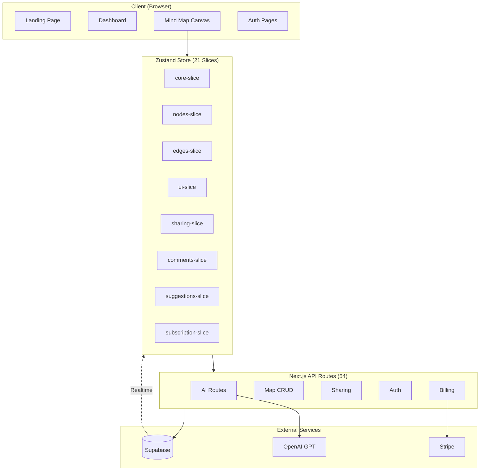
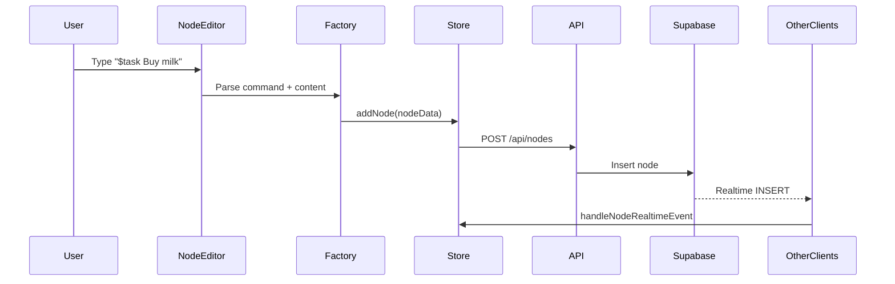
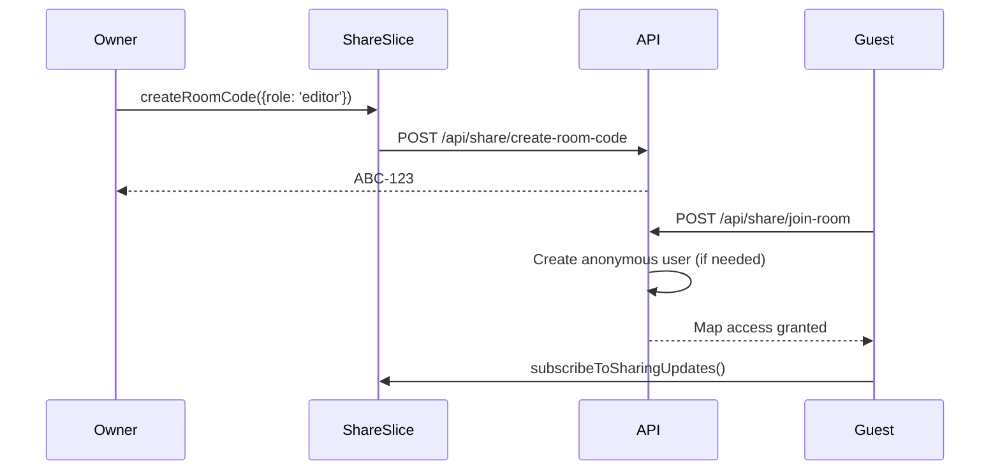
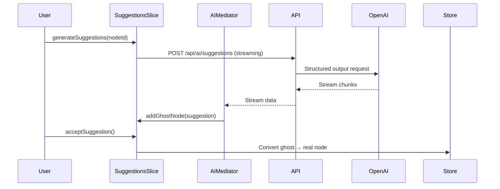

# Codebase Map: Shiko

> Auto-generated by Cartographer. Last mapped: 2026-01-14

A collaborative mind mapping application built with Next.js 16, React 19, TypeScript, Zustand, React Flow, and Supabase.

## System Overview



## Directory Structure

```
shiko/
├── src/
│   ├── app/                    # Next.js App Router pages & API
│   │   ├── api/                # 54 API routes
│   │   │   ├── ai/             # AI features (suggestions, chat, merges)
│   │   │   ├── auth/           # Sign-up, upgrade flows
│   │   │   ├── comments/       # Comment threads & reactions
│   │   │   ├── history/        # Version history
│   │   │   ├── maps/           # Map CRUD
│   │   │   ├── nodes/          # Node operations
│   │   │   ├── share/          # Room codes, collaboration
│   │   │   ├── subscriptions/  # Stripe integration
│   │   │   ├── templates/      # Map templates
│   │   │   └── user/           # Profile, billing
│   │   ├── auth/               # Sign-in/up pages
│   │   ├── dashboard/          # Map list, templates
│   │   ├── join/               # Room code join flow
│   │   └── mind-map/           # Canvas page
│   │
│   ├── components/             # React components (24 directories)
│   │   ├── ai-chat/            # AI chat panel
│   │   ├── auth/               # Auth UI (banner, upgrade, sign-up wizard)
│   │   ├── context-menu/       # Right-click menus
│   │   ├── dashboard/          # Map cards, settings
│   │   ├── edges/              # 6 edge types (floating, waypoint, ghost)
│   │   ├── guided-tour/        # Prezi-style presentations
│   │   ├── history/            # Version history sidebar
│   │   ├── landing/            # Marketing page sections
│   │   ├── mind-map/           # React Flow integration
│   │   ├── modals/             # Dialogs (edge edit, upgrade, etc.)
│   │   ├── node-editor/        # Command system, CodeMirror
│   │   ├── nodes/              # 12 node types + base wrapper
│   │   ├── onboarding/         # Multi-step onboarding
│   │   ├── realtime/           # Live cursors, presence
│   │   ├── sharing/            # Share panel, room codes
│   │   ├── subscription/       # Feature gates, limits
│   │   ├── toolbar/            # Canvas toolbar (desktop full + mobile overflow)
│   │   ├── ui/                 # 42 UI primitives (Base UI + custom)
│   │   └── waitlist/           # Landing page forms
│   │
│   ├── store/                  # Zustand state management
│   │   ├── slices/             # 21 focused slices
│   │   ├── app-state.ts        # Master state interface
│   │   └── mind-map-store.tsx  # Store composition
│   │
│   ├── registry/               # Node type system
│   │   ├── node-registry.ts    # Master config (40+ utilities)
│   │   ├── node-factory.ts     # Type-safe creation
│   │   ├── node-validation-schemas.ts  # Zod schemas
│   │   └── type-guards.ts      # Runtime checks
│   │
│   ├── helpers/                # Utilities
│   │   ├── api/                # API middleware (auth, validation)
│   │   ├── history/            # Delta calculation, diff
│   │   ├── layout/             # ELK.js layout engine
│   │   └── supabase/           # Client initialization
│   │
│   ├── hooks/                  # Custom React hooks
│   │   ├── collaboration/      # usePermissions
│   │   ├── realtime/           # Presence, cursors
│   │   └── subscription/       # Feature gates
│   │
│   ├── lib/                    # Core utilities
│   │   ├── validations/        # Zod schemas
│   │   └── ai-security/        # Rate limiting
│   │
│   ├── types/                  # TypeScript definitions (37 files)
│   ├── constants/              # App constants
│   ├── themes/                 # Design tokens
│   └── utils/                  # General utilities
│
├── e2e/                        # Playwright E2E tests
│   ├── fixtures/               # Test fixtures (3)
│   ├── pages/                  # Page objects (8)
│   ├── tests/                  # Test specs (48 active, incl. mobile toolbar + toast geometry)
│   └── utils/                  # Email client, screenshots
│
├── __tests__/utils/            # Jest test utilities
├── public/                     # Static assets
└── docs/                       # Documentation
```

## Module Guide

### State Management (21 Slices)

| Slice | Lines | Purpose |
|-------|-------|---------|
| **sharing-slice** | 1,164 | Room codes, anonymous users, upgrade flows |
| **comments-slice** | 973 | Comment threads, @mentions, reactions |
| **suggestions-slice** | 966 | AI ghost nodes, streaming, merges |
| **nodes-slice** | 900 | Node CRUD, positioning, real-time sync |
| **history-slice** | 597 | Undo/redo, snapshots, DB persistence |
| **edges-slice** | 635 | Edge CRUD, parent-child relationships |
| **subscription-slice** | 434 | Stripe, plan limits, usage tracking |
| **guided-tour-slice** | 416 | Prezi-style presentations |
| **core-slice** | 353 | Supabase client, user, map loading |
| **user-profile-slice** | 317 | Profile, preferences |
| **layout-slice** | 312 | ELK.js auto-layouts |
| **onboarding-slice** | 269 | Multi-step onboarding |
| **ui-slice** | 248 | Modals, panels, focus mode |
| **groups-slice** | 246 | Node grouping |
| **chat-slice** | 241 | AI chat messages |
| **streaming-toast-slice** | 168 | Progress toasts |
| **clipboard-slice** | 156 | Copy/paste |
| **export-slice** | 172 | PNG/SVG/PDF export |
| **quick-input-slice** | 55 | Quick node creation |
| **loading-state-slice** | 33 | Loading flags |
| **realtime-slice** | 17 | Selection sync |

### Node System (12 Types)

| Type | Category | Command | Purpose |
|------|----------|---------|---------|
| defaultNode | content | `$note` | Standard note |
| textNode | content | `$text` | Plain text |
| taskNode | content | `$task` | Checklist |
| codeNode | content | `$code` | Syntax highlighted |
| annotationNode | content | `$annotation` | Comments/notes |
| resourceNode | content | `$link` | URL preview |
| imageNode | media | `$image` | Image display |
| questionNode | ai | `$question` | Q&A format |
| referenceNode | structure | `$reference` | Cross-map link |
| groupNode | structure | — | Container (UI only) |
| commentNode | structure | — | Thread anchor (UI only) |
| ghostNode | ai | — | AI suggestions (system only) |

**Key Files:**
- `src/registry/node-registry.ts` - Master configuration
- `src/components/nodes/base-node-wrapper.tsx` - Shared wrapper
- `src/components/nodes/[type]-node.tsx` - Individual components

### API Routes (54 total)

**AI & Content (7):**
- `POST /api/ai/suggestions` - Streaming node suggestions
- `POST /api/ai/chat` - AI chat with context modes
- `POST /api/ai/suggest-connections` - Connection recommendations
- `POST /api/ai/suggest-merges` - Merge suggestions
- `POST /api/ai/counterpoints` - Opposing viewpoints

**Maps (3):**
- `GET/POST /api/maps` - List/create maps
- `GET/PUT/DELETE /api/maps/[id]` - Individual map
- `GET /api/maps/[id]/check-access` - Permission check

**Sharing (7):**
- `POST /api/share/create-room-code`
- `POST /api/share/join-room`
- `POST /api/share/revoke-room-code`
- `PUT /api/share/update-share/[shareId]`

**Auth (6):**
- `POST /api/auth/sign-up/initiate` → `verify-otp`
- `POST /api/auth/upgrade-anonymous/initiate` → `verify-otp` → `set-password`

**Subscriptions (4):**
- `POST /api/subscriptions/create`
- `POST /api/subscriptions/webhook` (Stripe)
- `POST /api/subscriptions/[id]/cancel`
- `POST /api/subscriptions/[id]/reactivate`

### Component Architecture

**Base Node Wrapper Pattern:**
```
[NodeType]Node.tsx
  └── BaseNodeWrapper (fixed 320px width, CSS auto-height)
        ├── Selection state
        ├── Node toolbar
        ├── Metadata bar
        ├── Collapse button
        └── [Content]Content.tsx
```

**UI Primitives (42 components):**
- 16 Base UI components (migrated from Radix)
- 26 custom components (button, card, avatar, sidebar, etc.)

## Data Flow

### Node Creation


### Collaboration Flow


### AI Suggestion Flow


## Testing Infrastructure

**Unit Tests (Jest + RTL):** 149+ tests
- Co-located: `*.test.tsx` next to components
- Utilities: `__tests__/utils/` (mock Supabase, store helpers)

**E2E Tests (Playwright):** 48 active (×3 browsers)
- Page Objects: 8 files in `e2e/pages/`
- Fixtures: base, multi-user, upgrade
- Baselines: Stored in Supabase Storage

**Test Gaps:** See `e2e/E2E_TEST_GAPS.md`

## Conventions

**Naming:**
- Components: PascalCase (`NodeEditor.tsx`)
- Hooks: camelCase with `use` prefix (`usePermissions.ts`)
- Slices: kebab-case (`sharing-slice.ts`)
- Types: PascalCase interfaces (`NodeData`, `AppState`)

**Patterns:**
- Early return over nested conditions
- Arrow functions over function declarations
- `useShallow` for Zustand selectors
- Zod for all validation

**State Updates:**
- `markNodeAsSystemUpdate()` before real-time updates (prevents save loops)
- 2s debounce on node/edge saves
- Optimistic UI with rollback on error

## Gotchas

1. **NodeData.metadata** - Single unified type (not discriminated union) to enable seamless type switching without data loss

2. **Rate Limiting** - In-memory only (`src/helpers/api/rate-limiter.ts`), won't scale horizontally

3. **Ghost Nodes** - System-only (`userCreatable: false`), filtered from exports

4. **Permission Loading** - Owner check happens FIRST to prevent blocking UI

5. **Export CORS** - External images swapped with placeholders to avoid canvas tainting

6. **ELK Layout** - Heavy computation offloaded to Web Worker (`public/elk-worker.js`)

7. **Keyboard Shortcuts** - Detect input focus to prevent hijacking typing; shortcuts FAB is hidden on mobile (`<768px`)

8. **Multi-User Tests** - Run serially (`chromium-serial` project) to avoid `revokeAllCodes()` race conditions

9. **Mind-Map Toast Positioning** - Bottom-right toasts use runtime dock clearance (`--mind-map-toolbar-clearance`) computed from the bottom toolbar container in `react-flow-area.tsx`; Sonner mobile full-width behavior is overridden at `<=600px` to keep toasts compact and right-aligned

## Navigation Guide

**Add a new node type:**
1. Add config to `src/registry/node-registry.ts`
2. Create `src/components/nodes/[type]-node.tsx`
3. Create `src/components/nodes/content/[type]-content.tsx`
4. Add command to `src/components/node-editor/core/commands/node-commands.ts`
5. Add Zod schema to `src/registry/node-validation-schemas.ts`

**Add a new API route:**
1. Create `src/app/api/[path]/route.ts`
2. Use appropriate middleware (`withApiValidation`, `withAuthValidation`, etc.)
3. Add Zod schema if needed
4. Add to `src/lib/api.ts` client

**Add a new Zustand slice:**
1. Create `src/store/slices/[name]-slice.ts`
2. Add to `src/store/app-state.ts` interface
3. Compose in `src/store/mind-map-store.tsx`

**Add a new UI component:**
1. Create in `src/components/ui/[name].tsx`
2. Follow Base UI patterns for headless components
3. Use `cn()` for class merging

**Add an E2E test:**
1. Add page object methods to `e2e/pages/[page].page.ts`
2. Create test in `e2e/tests/[feature]/[name].spec.ts`
3. Use appropriate fixture (base, multi-user, upgrade)
