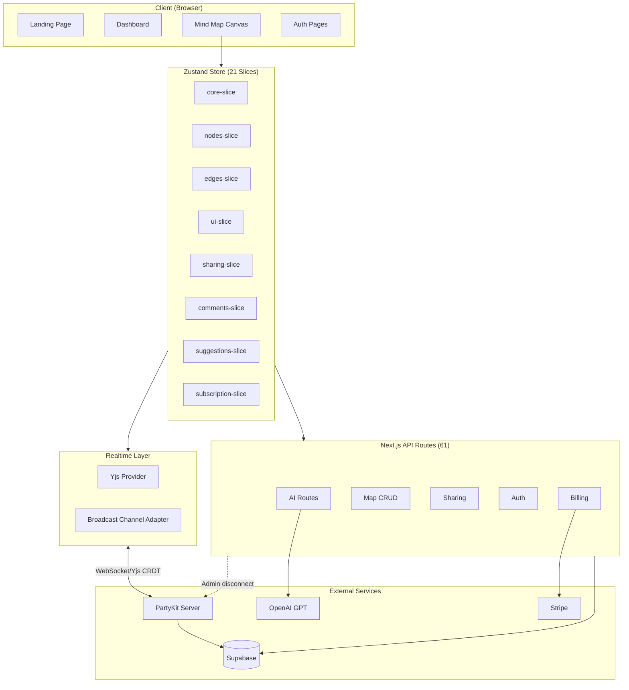
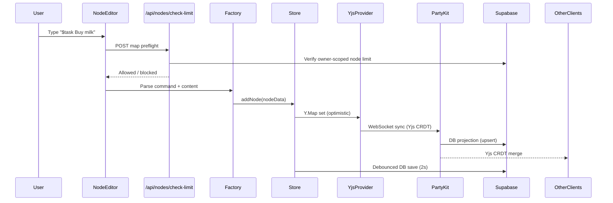
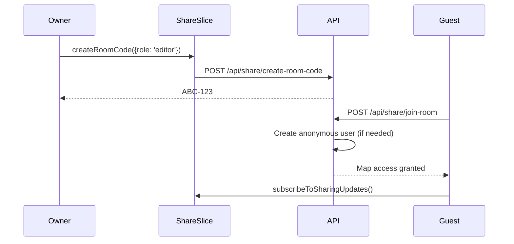
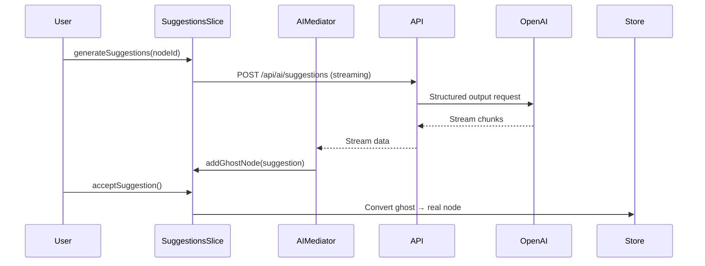
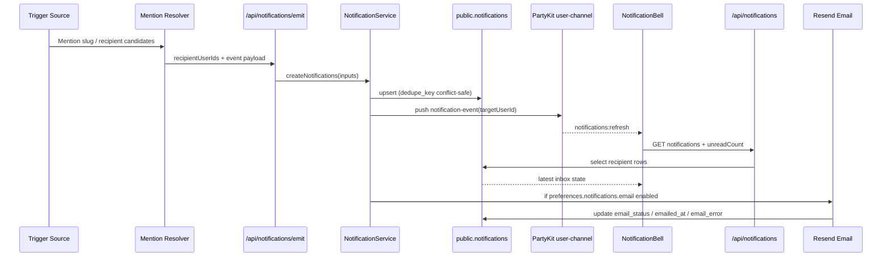

# Codebase Map: Shiko

> Auto-generated by Cartographer. Last mapped: 2026-02-23

<!-- Updated: 2026-02-24 - Documented shared permission event types and Yjs per-subscriber sync cursor pruning -->
<!-- Updated: 2026-02-27 - Documented map settings discard-confirm flow and template-control removal -->
<!-- Updated: 2026-02-27 - Documented account settings discard/cancel-confirm dialog flows -->
<!-- Updated: 2026-02-28 - Documented node-editor parser cleanup and dual syntax help behavior -->
<!-- Updated: 2026-03-04 - Added notification architecture (DB + APIs + mention resolution + inbox UI) -->
<!-- Updated: 2026-03-04 - Switched notification inbox refresh to PartyKit user-channel realtime events -->
<!-- Updated: 2026-03-04 - Added account settings email-notification preference toggle -->
<!-- Updated: 2026-03-04 - Expanded notifications internals (service/channel/schema/mention resolver/data flow) -->
<!-- Updated: 2026-03-04 - Corrected API route totals to 61 and fixed unlabeled directory-tree code fence -->
<!-- Updated: 2026-03-11 - Documented deterministic local branch reflow, cousin-branch corridor expansion, persisted map layout direction, the two supported layout modes, and auto-routed waypoint edges -->
<!-- Updated: 2026-03-05 - Documented owner-scoped node-limit enforcement across node creation APIs -->
<!-- Updated: 2026-03-06 - Synced API route docs for owner-scoped shared-map node entitlement checks -->
<!-- Updated: 2026-03-07 - Added owner-scoped node-limit preflight to node creation flow -->
<!-- Updated: 2026-03-17 - Documented editor-first onboarding v2 state, placement, and upgrade-modal split -->
<!-- Updated: 2026-03-17 - Added onboarding substeps, expanded toolbar anchors, and canvas-safe walkthrough positioning -->
<!-- Updated: 2026-03-18 - Documented mobile onboarding shell, viewport-aware coachmarks, and touch edit action -->
<!-- Updated: 2026-03-18 - Documented premium mobile editor drawer and shared notifications hook -->
<!-- Updated: 2026-03-25 - Documented shared notifications manager, map-scoped notification queries, and user-scoped onboarding persistence -->
<!-- Updated: 2026-03-28 - Reconciled local layout docs with owner-limit, onboarding, and mobile editor architecture during PR #46 merge -->
<!-- Updated: 2026-03-28 - Documented stale-safe layout normalization writes and in-flight animation synchronization after CodeRabbit review -->

A collaborative mind mapping application built with Next.js 16, React 19, TypeScript, Zustand, React Flow, and Supabase.

**Edge routing note:** Normal persisted edges render as auto-routed `waypointEdge` geometry. Explicit full layout uses ELK bend points (`routingStyle: 'elk'`); local create/edit/move/resize/reconnect flows reroute only affected edges with the deterministic orthogonal router (`routingStyle: 'orthogonal'`). Raw manual waypoint editing is no longer part of the canvas model.
**Layout animation note:** `ReactFlowArea` now renders through a transient animated graph state for explicit full layout and local layout flows. Zustand still stores only final node/edge geometry; the 550ms tween is client-only and does not persist or broadcast intermediate frames, and an animation version is only marked handled after the tween settles or is explicitly cancelled.

**Local layout note:** Deterministic local branch reflow now has two phases: same-depth child repack inside the edited branch, then cousin-branch corridor expansion on the carrier layer when the grown subtree would overlap neighboring cousin subtrees. Ancestors stay fixed, and load-time legacy layout normalization persists only when the fetched map/edge snapshot is still current.

## System Overview


```mermaid
graph TB
    subgraph Client["Client (Browser)"]
        Landing[Landing Page]
        Dashboard[Dashboard]
        Canvas[Mind Map Canvas]
        Auth[Auth Pages]
    end

    subgraph State["Zustand Store (21 Slices)"]
        Core[core-slice]
        Nodes[nodes-slice]
        Edges[edges-slice]
        UI[ui-slice]
        Sharing[sharing-slice]
        Comments[comments-slice]
        AI[suggestions-slice]
        Subs[subscription-slice]
    end

    subgraph Realtime["Realtime Layer"]
        YjsProvider[Yjs Provider]
        BroadcastAdapter[Broadcast Channel Adapter]
    end

    subgraph API["Next.js API Routes (61)"]
        AIRoutes[AI Routes]
        MapRoutes[Map CRUD]
        ShareRoutes[Sharing]
        AuthRoutes[Auth]
        BillingRoutes[Billing]
    end

    subgraph External["External Services"]
        Supabase[(Supabase)]
        PartyKit[PartyKit Server]
        OpenAI[OpenAI GPT]
        Stripe[Stripe]
    end

    Canvas --> State
    State --> Realtime
    Realtime <-->|WebSocket/Yjs CRDT| PartyKit
    PartyKit --> Supabase
    State --> API
    API --> Supabase
    AIRoutes --> OpenAI
    BillingRoutes --> Stripe
    API -.->|Admin disconnect| PartyKit
```

## Architecture

### Notifications


```mermaid
flowchart LR
    Triggers["Triggers\nquick-input assignee mentions\ncomment mentions/replies/reactions\nshare access updates"] --> MentionResolver["Mention Resolver\n/api/maps/[id]/mentionable-users\nslug -> userId maps in quick-input/comment-reply input"]
    MentionResolver --> Emit["POST /api/notifications/emit\ntoNotificationInsertPayload()"]
    Emit --> NotificationService["Notification Service\ncreateNotifications() + processNotificationEmails()"]
    NotificationService --> NotificationsTable[("public.notifications")]
    NotificationService --> PartyKitAdmin["pushPartyKitNotificationEvent()"]
    PartyKitAdmin --> UserChannel["PartyKit user room\nuser:{userId}:notifications"]
    UserChannel --> NotificationChannel["subscribeToNotificationChannel()"]
    NotificationChannel --> SharedInbox["sharedNotifications manager\nsingle cache/socket per user\nstable external-store snapshots"]
    SharedInbox --> InboxRefresh["NotificationBell/MobileMenu -> useNotifications()"]
    InboxRefresh --> NotificationsApi["GET /api/notifications"]
    NotificationsApi --> NotificationsTable
    NotificationService --> EmailPreference["resolveEmailPreferenceFromProfile()\npreferences.notifications.email"]
    EmailPreference --> Resend["Resend email send / email_status update"]
```

**DB schema (`public.notifications`):**

- Identity/context: `id`, `recipient_user_id`, `actor_user_id`, `map_id`, `event_type`
- Content/dedupe: `title`, `body`, `metadata`, `dedupe_key` (`recipient_user_id + event_type + dedupe_key` unique index)
- Inbox state: `is_read`, `read_at`, `created_at`, `updated_at`
- Email state: `email_status`, `email_error`, `emailed_at`
- Access control: RLS policies limit `SELECT/UPDATE` to recipient (`recipient_user_id = auth.uid()`)

**Client/runtime notes:**

- `useNotifications()` now fans out from a module-level shared manager instead of opening a socket per hook instance.
- `GET /api/notifications` accepts `mapId` and applies the map filter before `limit`, so map-scoped inboxes receive the newest N notifications for that map.
- `mark-all-read` already accepts `mapId`; refresh flows now keep the bell and mobile drawer inbox in sync through the shared cache.

## Directory Structure

```text
shiko/
├── src/
│   ├── app/                    # Next.js App Router pages & API
│   │   ├── api/                # 61 API routes
│   │   │   ├── ai/             # AI features (suggestions, chat, merges)
│   │   │   ├── auth/           # Sign-up, upgrade flows
│   │   │   ├── comments/       # Comment threads & reactions
│   │   │   ├── history/        # Version history
│   │   │   ├── maps/           # Map CRUD
│   │   │   ├── nodes/          # Node operations
│   │   │   ├── share/          # Room codes, collaboration
│   │   │   ├── subscriptions/  # Stripe integration
│   │   │   ├── templates/      # Map templates
│   │   │   └── user/           # Profile, billing
│   │   ├── auth/               # Sign-in/up pages
│   │   ├── dashboard/          # Map list, templates
│   │   ├── join/               # Room code join flow
│   │   └── mind-map/           # Canvas page
│   │
│   ├── components/             # React components (25 directories)
│   │   ├── ai-chat/            # AI chat panel
│   │   ├── auth/               # Auth UI (banner, upgrade, sign-up wizard)
│   │   ├── context-menu/       # Right-click menus
│   │   ├── dashboard/          # Map cards, settings
│   │   ├── edges/              # 6 edge types (floating, waypoint, ghost)
│   │   ├── guided-tour/        # Prezi-style presentations
│   │   ├── history/            # Version history sidebar
│   │   ├── landing/            # Marketing page sections
│   │   ├── mind-map/           # React Flow integration + mobile top bar/drawer chrome
│   │   ├── modals/             # Dialogs (edge edit, upgrade, etc.)
│   │   ├── node-editor/        # Command system, CodeMirror
│   │   ├── nodes/              # 12 node types + base wrapper
│   │   ├── notifications/      # Notification bell + shared inbox data hook
│   │   ├── onboarding/         # Editor-first onboarding shell (intro/checklist/coachmarks/upsell)
│   │   ├── realtime/           # Live cursors, presence
│   │   ├── sharing/            # Share panel, room codes
│   │   ├── subscription/       # Feature gates, limits
│   │   ├── toolbar/            # Canvas toolbar (desktop full + mobile overflow)
│   │   ├── ui/                 # 42 UI primitives (Base UI + custom)
│   │   └── waitlist/           # Landing page forms
│   │
│   ├── store/                  # Zustand state management
│   │   ├── slices/             # 21 focused slices
│   │   ├── app-state.ts        # Master state interface
│   │   └── mind-map-store.tsx  # Store composition
│   │
│   ├── registry/               # Node type system
│   │   ├── node-registry.ts    # Master config (40+ utilities)
│   │   ├── node-factory.ts     # Type-safe creation
│   │   ├── node-validation-schemas.ts  # Zod schemas
│   │   └── type-guards.ts      # Runtime checks
│   │
│   ├── helpers/                # Utilities
│   │   ├── api/                # API middleware (auth, validation)
│   │   ├── history/            # Delta calculation, diff
│   │   ├── layout/             # ELK full-layout engine + deterministic local branch reflow
│   │   ├── partykit/           # PartyKit admin helpers (disconnect users)
│   │   └── supabase/           # Client initialization
│   │
│   ├── hooks/                  # Custom React hooks
│   │   ├── collaboration/      # usePermissions
│   │   ├── realtime/           # Presence, cursors
│   │   └── subscription/       # Feature gates
│   │
│   ├── lib/                    # Core utilities
│   │   ├── realtime/           # Yjs provider, broadcast adapter, graph-sync, room-names
│   │   ├── validations/        # Zod schemas
│   │   └── ai-security/        # Rate limiting
│   │
│   ├── types/                  # TypeScript definitions (39 files)
│   ├── constants/              # App constants
│   ├── themes/                 # Design tokens
│   └── utils/                  # General utilities
│
├── e2e/                        # Playwright E2E tests
│   ├── fixtures/               # Test fixtures (3)
│   ├── pages/                  # Page objects (8)
│   ├── tests/                  # Test specs (48 active, incl. mobile toolbar multi-select + toast geometry)
│   └── utils/                  # Email client, screenshots
│
├── partykit/                   # PartyKit server (Yjs CRDT + DB projection)
│   ├── auth.ts                 # JWT verification via Supabase JWKS
│   └── server.ts               # WebSocket server with admin API
├── __tests__/utils/            # Jest test utilities
├── public/                     # Static assets
└── docs/                       # Documentation
```

## Module Guide

### State Management (21 Slices)

| Slice                     | Lines | Purpose                                                                       |
| ------------------------- | ----- | ----------------------------------------------------------------------------- |
| **sharing-slice**         | 1,164 | Room codes, anonymous users, upgrade flows                                    |
| **comments-slice**        | 973   | Comment threads, @mentions, reactions                                         |
| **suggestions-slice**     | 966   | AI ghost nodes, streaming, merges                                             |
| **nodes-slice**           | 900   | Node CRUD, positioning, real-time sync                                        |
| **history-slice**         | 597   | Undo/redo, snapshots, DB persistence                                          |
| **edges-slice**           | 635   | Edge CRUD, parent-child relationships                                         |
| **subscription-slice**    | 434   | Stripe, plan limits, usage tracking                                           |
| **guided-tour-slice**     | 416   | Prezi-style presentations                                                     |
| **core-slice**            | 353   | Supabase client, user, map loading                                            |
| **user-profile-slice**    | 317   | Profile, preferences                                                          |
| **layout-slice**          | 578   | Full ELK layouts + local branch reflow                                        |
| **onboarding-slice**      | 958   | Editor-first onboarding tasks, substeps, coachmarks, per-user persisted state |
| **ui-slice**              | 248   | Modals, panels, focus mode                                                    |
| **groups-slice**          | 246   | Node grouping                                                                 |
| **chat-slice**            | 241   | AI chat messages                                                              |
| **streaming-toast-slice** | 168   | Progress toasts                                                               |
| **clipboard-slice**       | 156   | Copy/paste                                                                    |
| **export-slice**          | 172   | PNG/SVG/PDF export                                                            |
| **quick-input-slice**     | 55    | Quick node creation                                                           |
| **loading-state-slice**   | 33    | Loading flags                                                                 |
| **realtime-slice**        | 17    | Selection sync                                                                |

### Node System (12 Types)

| Type           | Category  | Command       | Purpose                      |
| -------------- | --------- | ------------- | ---------------------------- |
| defaultNode    | content   | `$note`       | Standard note                |
| textNode       | content   | `$text`       | Plain text                   |
| taskNode       | content   | `$task`       | Checklist                    |
| codeNode       | content   | `$code`       | Syntax highlighted           |
| annotationNode | content   | `$annotation` | Comments/notes               |
| resourceNode   | content   | `$link`       | URL preview                  |
| imageNode      | media     | `$image`      | Image display                |
| questionNode   | ai        | `$question`   | Q&A format                   |
| referenceNode  | structure | `$reference`  | Cross-map link               |
| groupNode      | structure | —             | Container (UI only)          |
| commentNode    | structure | —             | Thread anchor (UI only)      |
| ghostNode      | ai        | —             | AI suggestions (system only) |

**Node Editor note:** Quick-input parser/help intentionally excludes `$reference` quick-switch and deprecated parser tokens (`bg:`, `border:`, `src:"..."`, `[[...]]`, `confidence:*`). Syntax Help is split into type-filtered `Universal` plus `Node-specific` sections.

**Key Files:**

- `src/registry/node-registry.ts` - Master configuration
- `src/components/nodes/base-node-wrapper.tsx` - Shared wrapper
- `src/components/nodes/[type]-node.tsx` - Individual components

### API Routes (61 total)

**AI & Content (7):**

- `POST /api/ai/suggestions` - Streaming node suggestions
- `POST /api/ai/chat` - AI chat with context modes
- `POST /api/ai/suggest-connections` - Connection recommendations
- `POST /api/ai/suggest-merges` - Merge suggestions
- `POST /api/ai/counterpoints` - Opposing viewpoints

**Maps (4):**

- `GET/POST /api/maps` - List/create maps
- `GET/PUT/DELETE /api/maps/[id]` - Individual map
- `GET /api/maps/[id]/check-access` - Permission check
- `GET /api/maps/[id]/mentionable-users` - Mention resolution roster

**Sharing (7):**

- `POST /api/share/create-room-code`
- `POST /api/share/join-room`
- `POST /api/share/revoke-room-code`
- `PATCH /api/share/update-share/[shareId]`

**Nodes (2):**

- `POST /api/nodes/check-limit` - Enforces per-map node limits for new nodes on map owner entitlement
- `POST /api/nodes/create-reference` - Applies same owner-based node-limit check for reference-node creation

**Notifications (4):**

- `GET /api/notifications` - List notifications + unread count
- `POST /api/notifications/mark-all-read` - Bulk mark as read
- `PATCH /api/notifications/[id]/read` - Toggle read state
- `POST /api/notifications/emit` - Emit mention/reply/reaction notifications

**Auth (6):**

- `POST /api/auth/sign-up/initiate` → `verify-otp`
- `POST /api/auth/upgrade-anonymous/initiate` → `verify-otp` → `set-password`

**Subscriptions (4):**

- `POST /api/subscriptions/create`
- `POST /api/subscriptions/webhook` (Stripe)
- `POST /api/subscriptions/[id]/cancel`
- `POST /api/subscriptions/[id]/reactivate`

### Component Architecture

**Base Node Wrapper Pattern:**

```
[NodeType]Node.tsx
  └── BaseNodeWrapper (fixed 320px width, CSS auto-height)
        ├── Selection state
        ├── Node toolbar
        ├── Metadata bar
        ├── Collapse button
        └── [Content]Content.tsx
```

**UI Primitives (42 components):**

- 16 Base UI components (migrated from Radix)
- 26 custom components (button, card, avatar, sidebar, etc.)

**Mind Map Settings Panel:**

- `src/components/mind-map/map-settings-panel.tsx` now focuses on persistable metadata fields (`title`, `description`, `tags`, `thumbnailUrl`) with client-side validation and explicit save flow
- `src/components/mind-map/discard-settings-changes-dialog.tsx` guards close actions when unsaved edits exist

**Dashboard Account/Billing Settings Panel:**

- `src/components/dashboard/settings-panel.tsx` uses changed-only account payload updates (`full_name`, `display_name`, `bio`, `preferences`) with deterministic validation and explicit save gating
- `src/components/dashboard/settings-panel.tsx` now includes an account-level email notifications toggle (`preferences.notifications.email`) used by notification email delivery
- `src/components/dashboard/discard-account-settings-changes-dialog.tsx` guards panel close when unsaved account edits exist
- `src/components/dashboard/cancel-subscription-dialog.tsx` adds an explicit confirmation step before subscription cancellation

**Editor Onboarding v2:**

- `src/components/onboarding/onboarding-modal.tsx` now renders the editor walkthrough shell directly inside the mind-map experience instead of using a global dialog in `ClientProviders`
- `src/store/slices/onboarding-slice.ts` tracks task-based progress (`create-node`, `try-pattern`, `know-controls`), real add-mode substeps (`toolbar` -> `canvas`), post-create edit hints, viewport-aware coachmark state (`desktop` vs `mobile`), minimized walkthrough state, and eligibility gating for first owned free maps
- `src/store/app-state.ts` + `src/store/slices/ui-slice.ts` extend node-editor state with onboarding preset/source fields so the walkthrough can open a deterministic parser example in the real quick-input editor
- `src/components/common/user-menu.tsx` and `src/components/subscription/limit-warning.tsx` now bypass onboarding entirely for upgrade prompts and open `popoverOpen.upgradeUser` directly
- Toolbar/top-bar/shortcut controls expose `data-onboarding-target` anchors for cursor/select, Add Node, AI Suggestions, Auto Layout, Export, Guided Tour, Reset Zoom, Comments, desktop Share, mobile hamburger menu, `More Tools`, shortcuts help, and breadcrumb/home
- Mobile onboarding uses bottom-sheet surfaces only: intro/checklist/hints/coachmarks never stack, step-specific sheets replace the checklist while active, the controls tour points to `mobile-menu` instead of the removed mobile share button, and the minimized walkthrough chip moves under the top bar instead of sharing the bottom-dock lane
- `src/components/nodes/base-node-wrapper.tsx` now exposes a touch-first `Edit` action for a single selected mobile node so onboarding can teach a real edit path instead of desktop-only shortcuts
- `src/components/mind-map/top-bar/index.tsx` now collapses the mobile header to breadcrumb/title plus one unread-aware hamburger trigger, while `src/components/mind-map/top-bar/mobile-menu.tsx` owns mobile share, notifications preview, collaborators, workspace actions, and account/billing flows in a full-height editorial drawer

**Notifications internals (operational map):**

- `src/components/node-editor/components/inputs/quick-input.tsx` + `src/components/nodes/components/comment-reply-input.tsx` + `src/app/api/maps/[id]/mentionable-users/route.ts`: resolve `@slug` -> `userId` recipient IDs
- `src/app/api/notifications/emit/route.ts` (`getMapParticipantContext`, `toNotificationInsertPayload`): trigger filtering + payload normalization -> `createNotifications()`
- `src/lib/notifications/notification-service.ts` (`createNotifications`, `processNotificationEmails`, `resolveEmailPreferenceFromProfile`): persist/dedupe -> PartyKit push -> optional email send
- `src/helpers/partykit/admin.ts` + `partykit/server.ts` (`notification-event`): admin publish -> user-channel fanout (`notifications:refresh`)
- `src/components/notifications/use-notifications.ts` + `src/lib/realtime/notification-channel.ts`: shared hook handles inbox fetch/subscription/mark-read state for both the desktop bell and the mobile editorial drawer
- `src/components/notifications/notification-bell.tsx`: desktop/dashboard bell is now a thin popover view over the shared notifications hook
- `src/components/dashboard/settings-panel.tsx`: account preference toggle persists `preferences.notifications.email` used by email delivery gating

## Data Flow

### Node Creation


```mermaid
sequenceDiagram
    participant User
    participant NodeEditor
    participant NodeLimitAPI as /api/nodes/check-limit
    participant Factory
    participant Store
    participant YjsProvider
    participant PartyKit
    participant Supabase
    participant OtherClients

    User->>NodeEditor: Type "$task Buy milk"
    NodeEditor->>NodeLimitAPI: POST map preflight
    NodeLimitAPI->>Supabase: Verify owner-scoped node limit
    NodeLimitAPI-->>NodeEditor: Allowed / blocked
    NodeEditor->>Factory: Parse command + content
    Factory->>Store: addNode(nodeData)
    Store->>YjsProvider: Y.Map set (optimistic)
    YjsProvider->>PartyKit: WebSocket sync (Yjs CRDT)
    PartyKit->>Supabase: DB projection (upsert)
    PartyKit-->>OtherClients: Yjs CRDT merge
    Store->>Supabase: Debounced DB save (2s)
```

### Collaboration Flow


```mermaid
sequenceDiagram
    participant Owner
    participant ShareSlice
    participant API
    participant Guest

    Owner->>ShareSlice: createRoomCode({role: 'editor'})
    ShareSlice->>API: POST /api/share/create-room-code
    API-->>Owner: ABC-123

    Guest->>API: POST /api/share/join-room
    API->>API: Create anonymous user (if needed)
    API-->>Guest: Map access granted
    Guest->>ShareSlice: subscribeToSharingUpdates()
```

### AI Suggestion Flow


```mermaid
sequenceDiagram
    participant User
    participant SuggestionsSlice
    participant AIMediator
    participant API
    participant OpenAI

    User->>SuggestionsSlice: generateSuggestions(nodeId)
    SuggestionsSlice->>API: POST /api/ai/suggestions (streaming)
    API->>OpenAI: Structured output request
    OpenAI-->>API: Stream chunks
    API-->>AIMediator: Stream data
    AIMediator->>SuggestionsSlice: addGhostNode(suggestion)
    User->>SuggestionsSlice: acceptSuggestion()
    SuggestionsSlice->>Store: Convert ghost → real node
```

### Notification Flow


```mermaid
sequenceDiagram
    participant Trigger as Trigger Source
    participant MentionResolver as Mention Resolver
    participant EmitAPI as /api/notifications/emit
    participant NotificationService as NotificationService
    participant DB as public.notifications
    participant PartyKit as PartyKit user-channel
    participant Bell as NotificationBell
    participant NotificationsAPI as /api/notifications
    participant Email as Resend Email

    Trigger->>MentionResolver: Mention slug / recipient candidates
    MentionResolver->>EmitAPI: recipientUserIds + event payload
    EmitAPI->>NotificationService: createNotifications(inputs)
    NotificationService->>DB: upsert (dedupe_key conflict-safe)
    NotificationService->>PartyKit: push notification-event(targetUserId)
    PartyKit-->>Bell: notifications:refresh
    Bell->>NotificationsAPI: GET notifications + unreadCount
    NotificationsAPI->>DB: select recipient rows
    DB-->>Bell: latest inbox state
    NotificationService->>Email: if preferences.notifications.email enabled
    Email->>DB: update email_status / emailed_at / email_error
```

## Testing Infrastructure

**Unit Tests (Jest + RTL):** 149+ tests

- Co-located: `*.test.tsx` next to components
- Utilities: `__tests__/utils/` (mock Supabase, store helpers)

**E2E Tests (Playwright):** 48 active (×3 browsers)

- Page Objects: 8 files in `e2e/pages/`
- Fixtures: base, multi-user, upgrade
- Baselines: Stored in Supabase Storage

**Test Gaps:** See `e2e/E2E_TEST_GAPS.md`

## Conventions

**Naming:**

- Components: PascalCase (`NodeEditor.tsx`)
- Hooks: camelCase with `use` prefix (`usePermissions.ts`)
- Slices: kebab-case (`sharing-slice.ts`)
- Types: PascalCase interfaces (`NodeData`, `AppState`)

**Patterns:**

- Early return over nested conditions
- Arrow functions over function declarations
- `useShallow` for Zustand selectors
- Zod for all validation

**State Updates:**

- `markNodeAsSystemUpdate()` before real-time updates (prevents save loops)
- 2s debounce on node/edge saves
- Optimistic UI with rollback on error

## Gotchas

1. **NodeData.metadata** - Single unified type (not discriminated union) to enable seamless type switching without data loss

2. **Rate Limiting** - In-memory only (`src/helpers/api/rate-limiter.ts`), won't scale horizontally

3. **Ghost Nodes** - System-only (`userCreatable: false`), filtered from exports

4. **Permission Loading** - Owner check happens FIRST to prevent blocking UI

5. **Export CORS** - External images swapped with placeholders to avoid canvas tainting

6. **ELK Layout** - Heavy computation offloaded to Web Worker (`public/elk-worker.js`)

7. **Keyboard Shortcuts** - Detect input focus to prevent hijacking typing; shortcuts FAB is hidden on mobile (`<768px`)

8. **Multi-User Tests** - Run serially (`chromium-serial` project) to avoid `revokeAllCodes()` race conditions

9. **Mind-Map Toast Positioning** - Bottom-right toasts use runtime dock clearance (`--mind-map-toolbar-clearance`) computed from the bottom toolbar container in `react-flow-area.tsx`; Sonner mobile full-width behavior is overridden at `<=600px` to keep toasts compact and right-aligned

10. **Toaster Targeting** - App-wide Sonner overrides are scoped via `.app-toaster` (set in `src/app/layout.tsx`) so mobile width/position adjustments do not unintentionally affect non-app toaster instances

11. **Mobile Tap Multi-Select** - Stored in Zustand (`mobileTapMultiSelectEnabled`), exposed via the cursor tool dropdown, and only active when `isMobile && canEdit && activeTool === 'default'`; node dragging is disabled while active and pane taps clear selection without turning the mode off

12. **Selection Bounds Context Menu** - Right-clicking the React Flow multi-selection rectangle requires `onSelectionContextMenu` wiring; without it, the browser native context menu appears instead of app actions

13. **Group Node Detection** - Ungroup menu visibility must handle mixed group markers (`type`, `data.node_type`, `data.nodeType`, `metadata.isGroup`, and `metadata.groupChildren`) to support legacy and current nodes

14. **PartyKit Ref-Counted Rooms** - `ensureRoomContext()` in yjs-provider.ts uses reference counting; each caller that opens a room must call the returned cleanup function. Rooms are only destroyed when the ref count reaches 0.

15. **Dual-Write Pattern** - Nodes/edges are written to both Yjs (optimistic, real-time) and Supabase (debounced, persistent). The PartyKit server also projects Yjs state to DB. The 3-second system update window (`markNodeAsSystemUpdate`) prevents save loops when remote changes arrive.

16. **PartyKit Admin Disconnect** - When access is revoked (delete-share, update-share, revoke-room-code), the API calls `disconnectPartyKitUsers()` to force immediate WebSocket disconnection across all room types for the affected users.

17. **Yjs Sync Event Retention** - `subscribeToYjsSyncEvents()` now tracks per-subscriber cursors and only prunes events up to the slowest subscriber cursor (bounded by max retention). This prevents index-shift event loss for slower consumers.

## Navigation Guide

**Add a new node type:**

1. Add config to `src/registry/node-registry.ts`
2. Create `src/components/nodes/[type]-node.tsx`
3. Create `src/components/nodes/content/[type]-content.tsx`
4. Add command to `src/components/node-editor/core/commands/node-commands.ts`
5. Add Zod schema to `src/registry/node-validation-schemas.ts`

**Add a new API route:**

1. Create `src/app/api/[path]/route.ts`
2. Use appropriate middleware (`withApiValidation`, `withAuthValidation`, etc.)
3. Add Zod schema if needed
4. Add to `src/lib/api.ts` client

**Add a new Zustand slice:**

1. Create `src/store/slices/[name]-slice.ts`
2. Add to `src/store/app-state.ts` interface
3. Compose in `src/store/mind-map-store.tsx`

**Add a new UI component:**

1. Create in `src/components/ui/[name].tsx`
2. Follow Base UI patterns for headless components
3. Use `cn()` for class merging

**Add an E2E test:**

1. Add page object methods to `e2e/pages/[page].page.ts`
2. Create test in `e2e/tests/[feature]/[name].spec.ts`
3. Use appropriate fixture (base, multi-user, upgrade)
