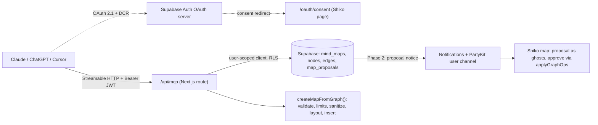

# Shiko MCP — exploration

Status: exploration, nothing built. Written 2026-10-09 against `main` at `525d8da`.

## TL;DR

- **What it is.** A remote MCP server that lives inside Shiko (`/api/mcp`). People add it to Claude, ChatGPT, Cursor or Claude Code once, sign in with their Shiko account, and from then on their own AI can read their maps and build new ones.
- **Why it fits Shiko.** The AI the person already pays for does the heavy reading (a 300-page manuscript, a meeting transcript, a codebase). Shiko does what it is good at: a map you can see, rearrange, share and present. None of it touches our OpenAI quota.
- **The creative-writing case works best as "build a new map".** A new map has no open tabs and no live PartyKit room, so the server can write it in one go, the same way template maps are seeded today (`POST /api/maps` with `template_id`). That avoids the hardest part of the codebase (live sync) for the first release.
- **Changes to existing maps should be proposals, not direct writes.** The MCP server saves a proposal; the person opens the map, sees the changes as ghosts and approves them. Approval runs through the existing `applyGraphOps` path in the browser, so live sync, history, permissions and the "AI suggests, you approve" model all keep working unchanged.
- **Auth: Supabase Auth's OAuth 2.1 server.** Its access tokens are normal Supabase JWTs, so our existing RLS policies apply to MCP calls as they are. It is still a **public beta** and only has coarse scopes, so a one-day spike to prove it works with Claude's connector flow comes before anything else.
- **The AI never sends coordinates.** It sends a graph (things and how they relate); Shiko lays it out.

## 1. The creative-writing flow

John is halfway through a novel. He opens Claude, which has the Shiko connector, and pastes in acts I–III.

> "Map the story so far: acts, the key events in each, the characters, and *why* things happen. Flag anything that looks like a plot hole."

What happens:

1. Claude reads the acts. This is the expensive part, and it happens in John's Claude, not on our servers.
2. Guided by Shiko's `story_map` prompt (§7), Claude sends **one** `create_map_from_graph` call: groups for acts, nodes for events/characters/questions, labeled edges for cause and relationship.
3. Shiko validates it, checks John's plan limits, lays it out, saves it and returns a link plus a `key → node id` table.
4. John opens the link: acts as columns left to right, events flowing through them, the cast in a band above, "causes" arrows between events, open questions as question nodes, continuity warnings as annotations pinned to the event they're about.
5. Two weeks later, writing act IV: *"Check act IV against my Shiko map: does anyone act out of character, and which threads are still open?"* Claude calls `read_map`, compares, and (Phase 2) proposes new nodes for act IV that John approves in Shiko.

Step 5 is the part that makes it more than an import: the map becomes the **story bible** that any AI John uses can read and keep up to date.

### How story concepts map to Shiko today (no new node types)

| Story concept | Shiko representation | Why |
|---|---|---|
| Act / chapter | `groupNode` containing its events | Groups already exist and move as a unit (`metadata.groupId` / `groupChildren`) |
| Event / scene | `defaultNode` (note), markdown text | The universal node; renders markdown |
| Character | `defaultNode` tagged `#character` | Tags are searchable (Ctrl/Cmd+F) and filterable |
| Who is in which scene | tag on the event (`#romeo`) rather than an edge | Character→scene edges multiply fast (a cast of 8 across 40 scenes) and bury the causal arrows. Tags keep the canvas readable and canvas search still finds "every Romeo scene" |
| Cause / consequence | labeled edge (`causes`, `because`, `leads to`) | Edge labels already render and survive layout |
| Relationship | labeled edge between characters (`loves`, `betrays`) | Same |
| Open question / plot hole | `questionNode` | Fits the existing question UI |
| Continuity warning, theme note | `annotationNode` anchored to the event (`metadata.anchorNodeId`) | Anchored annotations follow their host and stay out of layout |
| Act status | `metadata.status` on the group (`draft`, `in-progress`) | Already a field |

A plugin (e.g. a "Character card" kind with typed fields) could come later, but the first version should prove the idea with built-in types, which every viewer and exporter already handles.

### Example call (Romeo and Juliet, public domain, trimmed)

```json
{
  "title": "Romeo and Juliet — story map",
  "layout": "story",
  "groups": [
    { "key": "act1", "label": "Act I · The feud and the ball" },
    { "key": "act3", "label": "Act III · The turn" }
  ],
  "nodes": [
    { "key": "romeo",  "type": "note", "text": "**Romeo** — Montague, impulsive, in love with love", "tags": ["character"] },
    { "key": "juliet", "type": "note", "text": "**Juliet** — Capulet, 13, the most decisive person in the play", "tags": ["character"] },
    { "key": "tybalt", "type": "note", "text": "**Tybalt** — Juliet's cousin, lives for the feud", "tags": ["character"] },

    { "key": "ball",       "group": "act1", "type": "note", "text": "Romeo crashes the Capulet ball and meets Juliet", "tags": ["romeo", "juliet"] },
    { "key": "mercutio",   "group": "act3", "type": "note", "text": "Tybalt kills Mercutio under Romeo's arm", "tags": ["tybalt", "romeo"] },
    { "key": "revenge",    "group": "act3", "type": "note", "text": "Romeo kills Tybalt", "tags": ["romeo", "tybalt", "turning-point"] },
    { "key": "banishment", "group": "act3", "type": "note", "text": "The Prince banishes Romeo", "tags": ["romeo"] },

    { "key": "why", "type": "question", "text": "Romeo has just married into the Capulets. Why does he throw that away in one scene?" },
    { "key": "warn", "type": "annotation", "anchor": "revenge", "annotationType": "warning", "text": "Tybalt recognised Romeo at the ball (I.5). Make sure that grudge is visible before III.1." }
  ],
  "edges": [
    { "from": "ball",     "to": "mercutio",   "label": "Tybalt's grudge" },
    { "from": "mercutio", "to": "revenge",    "label": "causes" },
    { "from": "revenge",  "to": "banishment", "label": "causes" },
    { "from": "romeo",    "to": "juliet",     "label": "loves" },
    { "from": "tybalt",   "to": "romeo",      "label": "hates" }
  ]
}
```

The response gives back `{ mapId, url, nodeIds: { "romeo": "<uuid>", … }, nodeCount, warnings }`, so follow-up calls can point at real nodes.

## 2. Why MCP rather than (only) an in-app "Import story" button

| | MCP | In-app import (our OpenAI) |
|---|---|---|
| Who reads the manuscript | The person's AI (large context, their tokens) | Our model, our cost, our context limit |
| Works without an AI subscription | No | Yes |
| Reach | Every MCP client: Claude, ChatGPT, Cursor, VS Code, Claude Code | Only inside Shiko |
| Ongoing use (story bible) | Natural: the AI reads the map whenever it needs to | Needs its own chat UI (we have `/api/ai/chat`, but it's map-scoped) |
| Control over quality | Lower; we shape it with tool descriptions and an MCP prompt | Full |

They are not either/or. Build the core as one server function, `createMapFromGraph(supabase, user, spec)`, that both the MCP tool and a later in-app import can call.

## 3. What already exists to build on

| Need | Existing piece |
|---|---|
| Create a map + graph on the server | Template seeding in `src/app/api/maps/route.ts` (POST with `template_id`): inserts map, nodes and edges with new ids. Not atomic today (it logs and continues on insert errors) |
| Node limit | `checkMapNodeLimit()` in `src/helpers/api/with-subscription-check.ts`, mirrored by the `enforce_map_node_limit` DB trigger |
| Reading a node as text | `getNodeSearchText` in `src/helpers/node-semantic-text.ts` (shared by AI rows and canvas search) |
| Anchored annotations folded into host text | `src/helpers/ai-anchored-annotations.ts` |
| Strip image/link/HTML exfiltration from AI text | `sanitizeRecipeText` in `src/helpers/ai-recipe-postprocess.ts` |
| Ghost suggestions + approval | `suggestions-slice`, typed `nodePayload` approval, `acceptSuggestion` → `applyGraphOps` with an actor |
| Attributed history | `applyGraphOps` actors (`user`, `plugin`, `recipe`) and `HistoryItem.actorLabel` |
| JWT verification | `jose` is already a dependency; PartyKit already verifies Supabase JWTs via JWKS |
| Live notices to a user | Notifications service + PartyKit user channel + web push |
| Layout | ELK (`elkjs`) presets in `src/helpers/layout/`, currently run in a browser Web Worker |

## 4. The hard constraint: live sync

How map writes work today (verified in code):

- The **browser is the only database writer** for nodes and edges. `partykit/server.ts` says so explicitly ("Browser is the only DB/history writer in Yjs mode"), and its DB projection is switched off unless `stateAuthority === 'yjs_primary'`, which nothing sets.
- The PartyKit room's Yjs doc is **seeded from the database when the first person connects** (`loadSyncDocFromDatabase`) and is dropped when the last person leaves.
- Open tabs learn about each other's changes **only through that Yjs doc** (`nodesById` / `edgesById` observers in `src/lib/realtime/yjs-provider.ts`). They do not watch the database.

So if a server-side MCP tool wrote nodes straight into the database of a map someone has open:

- the open tabs would not see them until reload, and
- the live Yjs doc would not contain them, so the map's live state and the database would disagree until the room empties.

Three ways to handle it:

| Option | How | Verdict |
|---|---|---|
| **A. New maps only** | `create_map_from_graph` writes a fresh map. No room exists yet, so the first person to open it seeds the room from the database as usual | **Phase 1.** Covers the headline use case with no realtime work |
| **B. Proposals** | MCP saves a row in a new `map_proposals` table (ops + client name). The app shows "Claude suggested 12 changes" on the map, renders them as ghosts and applies approved ones through `applyGraphOps` in the browser | **Phase 2.** Keeps the browser as the only graph writer, and keeps the CLAUDE.md rule that programmatic changes go through `applyGraphOps`. It also matches how Shiko AI already behaves |
| **C. Direct server writes + PartyKit push** | MCP writes the database, then calls a new admin-token PartyKit endpoint that applies the same records to the room's Yjs doc if the room is loaded | Later, only if people want edits to land without approval. Needs a server-side twin of `applyGraphOps` (permission, size caps, history actor) and care not to load a room just to push into it |

## 5. Auth

### Recommended: Supabase Auth as the OAuth 2.1 server

The MCP authorization spec requires OAuth 2.1 with discovery, and Claude's and ChatGPT's connector flows rely on it (including dynamic client registration). Supabase Auth now offers exactly this:

- Clients discover it at `<supabase>/.well-known/oauth-authorization-server/auth/v1` and can register themselves.
- Access tokens are **standard Supabase JWTs** with `user_id`, `role` and `client_id` claims. A Supabase client created with `Authorization: Bearer <token>` is that user, so **every existing RLS policy applies to MCP calls unchanged**.
- We host the consent screen. Supabase redirects to our page with an `authorization_id`; we confirm the user is signed in, show what the app is asking for and call approve or deny through supabase-js's OAuth server API (`AuthOAuthServerApi`, documented for the 2.1xx releases; we're on 2.117.2, so confirm the exact method names in the spike).

What we would add:

1. `src/app/oauth/consent/page.tsx`: sign-in check (reuse the `redirectedFrom` pattern), "Claude wants to read your maps and create new ones", Allow / Deny. Refuse anonymous (room-code guest) accounts here.
2. `src/app/.well-known/oauth-protected-resource/route.ts`: names the Supabase auth server.
3. In the MCP route: verify the bearer token against Supabase JWKS with `jose` (as PartyKit already does), require a `client_id` claim and a non-anonymous user, then build a per-request user-scoped Supabase client.
4. Settings › Connected apps: list grants and revoke them.

Caveats to settle in the spike:

- **Beta.** The OAuth server went to public beta on 2025-11-26 and I found no GA announcement. It needs to be enabled per project (plus dynamic registration), and it is free during the beta.
- **Coarse scopes.** Only `openid`, `email`, `profile`, `phone`. "Read-only vs can create maps" has to be our own setting per (user, client), stored by the consent page and checked by the write tools.
- **Revocation and the list of connected apps:** check which admin or user APIs exist for listing and revoking OAuth grants.

### Fallback: personal access tokens

A "Create token" button in Settings, with a hashed token in our own table. It works for Claude Code, Cursor and scripts (header auth) but **not** for Claude.ai or ChatGPT connectors, which expect OAuth. Use it only if the Supabase OAuth spike fails.

## 6. Server shape



- **Route:** `src/app/api/mcp/[transport]/route.ts` using Vercel's `mcp-handler` (`createMcpHandler` + `withMcpAuth`) on `@modelcontextprotocol/sdk`. Run it **stateless** (no session store), which suits Vercel functions. The newest spec revision is reported to drop protocol sessions altogether; check the current SDK and `mcp-handler` versions before pinning.
- **No middleware changes:** `src/proxy.ts` already skips `/api/*`, and the MCP route only returns JSON or event streams, so the page CSP doesn't affect it.
- **Rate limits:** MCP clients can call in tight loops. Use the existing limiter per user plus a per-call size cap. Keep in mind it is in-memory (known debt #2).
- **Service role:** never for MCP tools. Everything goes through the user-scoped client so RLS stays the guard.

## 7. Tools, prompts and resources (v1)

Tool names stay short; descriptions do the steering (MCP clients show them to the model).

| Tool | Phase | Hints | What it does |
|---|---|---|---|
| `list_maps` | 0 | read-only | The caller's maps and maps shared with them: id, title, node count, updated. Optional `query` |
| `read_map` | 0 | read-only | One map as a compact outline: groups → nodes (type, text via `getNodeSearchText`, tags, status), labeled edges, annotations folded into their host. Real node ids, since the agent needs stable references across calls. Caps output size and says when it truncated |
| `search_nodes` | 1 | read-only | Text match within a map (reuse canvas-search matching) |
| `create_map_from_graph` | 1 | write, not destructive | The call in §1. Atomic: the whole map or nothing |
| `propose_changes` | 2 | write, not destructive | Ops against an existing map (`add_node`, `update_text`, `add_edge`, `add_tag`), saved as a proposal for approval in Shiko |
| `get_proposal_status` | 2 | read-only | Pending / applied / declined, so the agent can follow up |

No delete tools in v1.

**MCP prompt `story_map`** (shows up as a slash command in Claude, e.g. `/shiko:story_map`): instructions for turning a manuscript into the §1 shape: acts as groups, events in order, the cast tagged `#character`, participation as tags, `causes` edges only for real causality, plot holes as questions, a node budget that fits the user's plan. Genre knowledge lives in the prompt rather than the tool schema, so other prompts (`meeting_map`, `research_map`, `codebase_map`) can come later without new tools.

**Resource:** `shiko://maps/{id}` returning the same outline as `read_map`, so clients that support attaching resources can pin a map into context.

### `create_map_from_graph` server steps

1. **Validate** with zod: unique keys; edges and anchors point at known keys; types restricted to the safe set already used by AI ghosts (`note`, `text`, `task`, `question`, `annotation`, `code`); caps (for example ≤ 300 nodes, ≤ 600 edges, ≤ 4 KB per node text, ≤ 40 groups).
2. **Limits:** preflight `checkMapNodeLimit` for the caller's plan. Free maps cap at 50 nodes and a novel easily needs 100–200, so return a clear error the model can act on: *"This map would have 143 nodes; John's plan allows 50 per map. Merge minor scenes or ask John to upgrade."* Never create a half-map.
3. **Sanitize** all text with `sanitizeRecipeText`: manuscripts are untrusted input, and an injected markdown image would send map text to a third-party URL when someone views the map.
4. **Layout** (§8).
5. **Insert** map, nodes and edges atomically. supabase-js has no multi-statement transactions, so either add a `SECURITY INVOKER` RPC `create_map_with_graph(jsonb)` (RLS and the node-limit trigger still run) or insert in order and delete the map if any step fails.
6. **Attribute:** mark nodes `metadata.isAiGenerated = true` and write the first history entry as "Created by Claude via MCP" (a new actor kind `{ kind: 'mcp', clientId, label }`).
7. **Return** `{ mapId, url, nodeIds, nodeCount, warnings }`.

## 8. Layout

Coordinates from an LLM are always bad, so the server owns placement:

- **First pass on the server:** run `elkjs` (it works in Node) with estimated node sizes based on text length, so a fresh map never opens as a pile at (0, 0) and read-only viewers see something sensible.
- **Tidy on first open:** set a one-shot `layout_pending` flag on the map. The first person with edit rights who opens it runs the real layout with measured sizes, saves it and clears the flag. This works around a lesson already in CLAUDE.md: node sizes and edge routes are only reliable after the canvas renders.
- **A "story" arrangement:** act groups left to right in order, events flowing inside each act, the cast in a band above, causal links and relationships as cross-links. This could start as `roomy-right` with group ordering and grow into its own preset. Open question: the current presets don't treat groups as layout containers (membership is `metadata.groupId`, not a React Flow parent), so group bounds would have to be computed from member bounds after layout.

## 9. Security notes

- **Prompt injection both ways.** Map text returned by `read_map` can come from collaborators on shared maps. Tool descriptions should label it as data, and the output should be clearly fenced. Text coming *in* is sanitized (§7.3).
- **Least privilege.** Read-only is the default on the consent screen, and creating maps is a separate checkbox. Write tools check that setting on every call.
- **Plan limits and the DB trigger** still apply because everything runs as the user.
- **Exports and ghosts:** proposal ghosts reuse the ghost type, which exports already filter out.
- **Audit:** every MCP write is attributed in history (actor kind `mcp`, client name), so "what did Claude change?" has an answer.
- **Privacy copy:** the privacy policy and FAQ should say that connected AI apps can read the maps the person can open, and that this data then goes to that AI provider under the person's own account with them.

## 10. Phased plan

| Phase | Scope | Rough size | Proves |
|---|---|---|---|
| **0 · Spike** | Enable Supabase OAuth server on a dev project, consent page, `/api/mcp` with `list_maps` + `read_map`, connect from Claude | 1–2 days | The riskiest piece: beta OAuth + dynamic registration + Claude connector end to end |
| **1 · Story maps** | `create_map_from_graph` (validate, limits, sanitize, server layout, atomic insert, history actor), `search_nodes`, `story_map` prompt, Settings › Connected apps, privacy copy | ~1–1.5 weeks | The John story works end to end |
| **2 · Proposals** | `map_proposals` table + RLS, `propose_changes`, proposal banner → ghosts → `applyGraphOps`, notification on new proposal | ~1–1.5 weeks | Ongoing story-bible use on existing maps without touching live sync |
| **3 · Polish** | MCP Apps (`ui://`) map preview inside Claude/ChatGPT; first-open "story" layout preset; more prompts (meeting, research, codebase) | open | The "wow" moment of seeing the map in the chat |

MCP Apps is the official MCP extension that lets a tool return an interactive HTML view rendered in the chat; Claude (web and desktop) and ChatGPT are listed as supporting it, and other clients fall back to the tool's text result. A read-only preview of the new map right in the conversation would make §1 land much harder, but it's polish, not foundation.

## 11. Contracts this would touch

- **CLAUDE.md "Programmatic graph changes"** says every API must go through `applyGraphOps()`. Phases 1–2 keep that true in spirit: a new map has no live graph to bypass, and proposals are applied through `applyGraphOps` in the browser. Option C would need the rule amended with a server-side twin.
- **`GraphActor`** gains `{ kind: 'mcp'; id: clientId; label }` and history shows its label.
- **Known debt #5 (schema drift):** new tables (`map_proposals`, connection settings) need the force-added migrations plus a prod apply, as with recipes and plugins.

## 12. Decisions for you

1. **Plan:** is MCP Pro-only, or free with the normal 50-node cap? The cap alone makes free story maps of real novels impractical.
2. **Auth:** OK to depend on Supabase's beta OAuth server (with access tokens as a fallback), or wait for GA?
3. **Edits to existing maps:** proposals-with-approval only (recommended), or should direct writes (option C) also be on the roadmap?
4. **Start with the Phase 0 spike?** It's small, it de-risks auth, and it gives a read-only connector you can try in Claude straight away.

## Sources

- [Supabase: OAuth 2.1 Server](https://supabase.com/docs/guides/auth/oauth-server), [MCP Authentication with Supabase](https://supabase.com/docs/guides/auth/oauth-server/mcp-authentication), [Getting started](https://supabase.com/docs/guides/auth/oauth-server/getting-started), [feature page (Public Beta)](https://supabase.com/features/oauth2-1-server), [changelog #38022](https://supabase.com/changelog/38022-oauth-2-1-server-capabilities-for-supabase-auth)
- [MCP draft changelog](https://modelcontextprotocol.io/specification/draft/changelog.md), [MCP 2026 stateless release (secondary)](https://xenospectrum.com/en/mcp-2026-stateless-release/), [Stack Overflow: auth in MCP](https://stackoverflow.blog/2026/01/21/is-that-allowed-authentication-and-authorization-in-model-context-protocol/)
- [Vercel: Deploy MCP servers](https://examples.vercel.com/docs/mcp/deploy-mcp-servers-to-vercel), [Clerk: build an MCP server on Next.js](https://clerk.com/docs/nextjs/guides/ai/mcp/build-mcp-server), [Descope: auth for MCP on Next.js](https://www.descope.com/blog/post/auth-mcp-nextjs)
- [WorkOS: MCP Apps](https://workos.com/blog/2026-01-27-mcp-apps), [MCP Apps overview (secondary)](https://www.morphllm.com/mcp-apps)

External facts were gathered by web search on 2026-10-09; the official Supabase and MCP pages were not reachable from this environment, so treat versions and statuses as "re-check before building".
